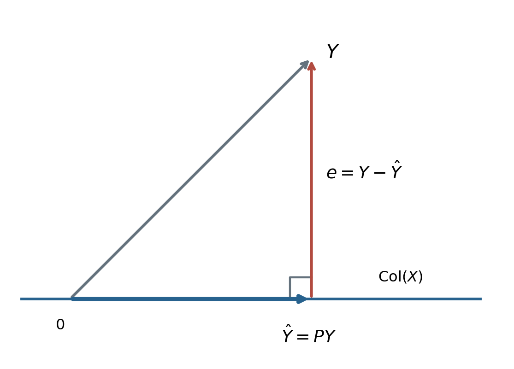
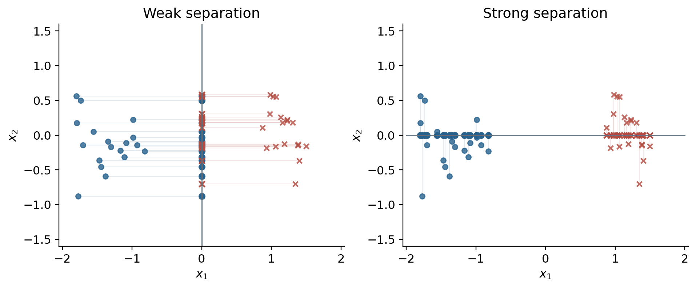

# 线性模型统一视角 {#sec-linear-models}

<!-- 来源：纸质稿 210–218；cheatsheet.md 的线性模型部分。贝叶斯后验简述参考 17.BayesianLR.md。 -->

许多经典模型从同一个线性得分 $w^\top x+b$ 出发，却赋予它不同含义：它可以是连续响应的预测值、决定类别的符号，也可以是对数几率。不同的损失函数、约束和概率假设，决定了我们怎样从数据中学习这个得分。

本章保留原稿的主线：先从四种视角理解线性回归，再比较感知机、逻辑回归、GDA、朴素贝叶斯和 Fisher 判别分析。

## 记号与偏置

训练集为 $\mathcal D=\{(x_i,y_i)\}_{i=1}^N$，其中 $x_i\in\mathbb R^p$ 是列向量。设计矩阵把样本按行堆叠：

$$
X=\begin{pmatrix}x_1^\top\\ \vdots\\x_N^\top\end{pmatrix}\in\mathbb R^{N\times p},\qquad
Y=\begin{pmatrix}y_1\\\vdots\\y_N\end{pmatrix}\in\mathbb R^N.
$$

不显式写偏置时，可理解为数据已经中心化，或者已将常数特征 $1$ 加入 $x$。使用正则化时要另行说明是否惩罚偏置；通常偏置不受惩罚。回归中的 $y_i$ 是实数；感知机采用 $\{-1,+1\}$ 标签；逻辑回归和 GDA 采用 $\{0,1\}$ 标签。

## 线性回归的四种理解

### 矩阵视角：最小二乘与正规方程

模型预测为 $\hat y_i=x_i^\top w$，整体预测为 $\hat Y=Xw$。注意 $Y$ 是观测值，通常不等于 $Xw$；残差为

$$
e=Y-Xw.
$$

希望整体误差尽可能小，可最小化残差的欧氏范数。平方不会改变最优点，因此使用平方损失：

$$
\begin{aligned}
L(w)&=\|Y-Xw\|_2^2\\
&=(Y-Xw)^\top(Y-Xw)\\
&=Y^\top Y-2w^\top X^\top Y+w^\top X^\top Xw.
\end{aligned}
$$

对 $w$ 求导，并令梯度为零：

$$
\nabla L(w)=2X^\top Xw-2X^\top Y=0,
\qquad X^\top X\hat w=X^\top Y.
$$

后一个式子称为**正规方程**。由于 Hessian 为 $2X^\top X\succeq0$，损失是凸函数，满足正规方程的解就是全局最小点。

当 $X$ 列满秩，即 $\operatorname{rank}(X)=p$ 时，

$$
\hat w=(X^\top X)^{-1}X^\top Y.
$$

这里“半正定”并不足以保证可逆。利用 $\operatorname{rank}(X^\top X)=\operatorname{rank}(X)$ 可知：特征之间存在精确线性依赖，或 $p>N$ 时，$X^\top X$ 必然奇异；特征高度相关但并非精确相关时，则可能可逆却数值病态。

**补充说明：秩不足时怎么办？** 最小二乘仍有解，预测向量仍唯一，参数可能不唯一。最小范数解为 $\hat w=X^+Y$。若紧致 SVD 为 $X=U_rD_rV_r^\top$，则

$$
X^+=V_rD_r^{-1}U_r^\top.
$$

只对非零奇异值取倒数。数值计算通常直接采用 QR 或 SVD，不必显式计算矩阵逆。

### 几何视角：到列空间的正交投影

所有可能的 $Xw$ 都位于 $\operatorname{Col}(X)$。最小二乘是在这个子空间中，寻找距离 $Y$ 最近的点 $\hat Y$。

由正规方程：

$$
X^\top(Y-X\hat w)=0,
\qquad X^\top e=0.
$$

记 $X$ 的第 $j$ 列为 $X_{:j}$，则上式意味着 $X_{:j}^\top e=0$ 对每一列成立。因此 $e$ 垂直于整个列空间：

$$
Y=\hat Y+e,\qquad
\hat Y\in\operatorname{Col}(X),\quad e\in\operatorname{Col}(X)^\perp.
$$

{#fig-projection width=78%}

列满秩时，投影矩阵为

$$
P=X(X^\top X)^{-1}X^\top,\qquad\hat Y=PY.
$$

它满足 $P^\top=P$ 和 $P^2=P$。第二个性质表示：已经投影到子空间里的点，再投影一次不会改变。秩不足时可统一写成 $P=XX^+$。

### 频率学派视角：最小二乘等价于高斯噪声下的 MLE

假设

$$
y_i=x_i^\top w+\varepsilon_i,\qquad
\varepsilon_i\overset{\mathrm{iid}}\sim\mathcal N(0,\sigma^2),\quad\sigma^2>0.
$$

于是条件密度为

$$
p(y_i\mid x_i,w)=\frac{1}{\sqrt{2\pi\sigma^2}}
\exp\!\left[-\frac{(y_i-x_i^\top w)^2}{2\sigma^2}\right].
$$

给定 $X$，样本条件独立，因此似然是各项密度的乘积。取对数，把连乘转为求和：

$$
\begin{aligned}
\ell(w)&=\log p(Y\mid X,w)\\
&=-\frac N2\log(2\pi\sigma^2)
-\frac{1}{2\sigma^2}\sum_{i=1}^N(y_i-x_i^\top w)^2.
\end{aligned}
$$

固定 $\sigma^2$ 时，第一项与 $w$ 无关，第二项前的系数为负，所以

$$
\arg\max_w\ell(w)=\arg\min_w\|Y-Xw\|_2^2.
$$

平方损失既有几何解释，也有概率解释。类似地，独立、同尺度的 Laplace 噪声对应绝对值损失。这说明许多损失可以解释为数据生成假设下的负对数似然，但并非所有人为设计的损失都必须来自概率模型。

### 贝叶斯视角：岭回归等价于高斯先验下的 MAP

当数据不足或特征相关性强时，参数估计可能很不稳定。岭回归在拟合误差之外惩罚参数大小：

$$
J(w)=\|Y-Xw\|_2^2+\lambda\|w\|_2^2,\qquad\lambda>0.
$$

求导得

$$
-2X^\top Y+2X^\top Xw+2\lambda w=0,
$$

所以

$$
\hat w=(X^\top X+\lambda I)^{-1}X^\top Y.
$$

对任意非零 $v$，$v^\top(X^\top X+\lambda I)v=\|Xv\|^2+\lambda\|v\|^2>0$，故该矩阵正定可逆。约束形式 $\min_w\|Y-Xw\|^2$、$\|w\|^2\le c$ 与惩罚形式通过拉格朗日乘子联系；对应的 $c$ 和 $\lambda$ 需要匹配，不是任意取值都相同。

现在引入先验 $w\sim\mathcal N(0,\tau^2I)$。贝叶斯公式给出

$$
p(w\mid X,Y)\propto p(Y\mid X,w)p(w).
$$

最大化后验等价于最大化对数后验：

$$
\log p(w\mid X,Y)
=C-\frac{1}{2\sigma^2}\|Y-Xw\|^2-\frac{1}{2\tau^2}\|w\|^2.
$$

乘以 $-2\sigma^2$ 后，得到岭回归目标，且

$$
\lambda=\frac{\sigma^2}{\tau^2}.
$$

先验越集中，$\tau^2$ 越小，正则化越强。高斯先验对应 $L_2$ 正则化；独立 Laplace 先验对应 $L_1$ 正则化，二者在原 cheatsheet 中写反了。

**补充说明：点估计与完整后验。** MLE 和 MAP 都只输出一个参数值。若保留高斯后验，并设一般先验协方差为 $\Sigma_p\succ0$，则配方可得

$$
\begin{aligned}
\Sigma_w&=(\sigma^{-2}X^\top X+\Sigma_p^{-1})^{-1},\\
\mu_w&=\sigma^{-2}\Sigma_wX^\top Y,\\
p(y_*\mid x_*,X,Y)&=\mathcal N(x_*^\top\mu_w,\;x_*^\top\Sigma_wx_*+\sigma^2).
\end{aligned}
$$

预测方差包含参数不确定性与观测噪声两部分；本书不另展开贝叶斯线性回归专题。

## 感知机：用误分类推动更新

感知机以线性得分的符号进行二分类：

$$
\hat y=\operatorname{sign}(w^\top x+b),\qquad y\in\{-1,+1\}.
$$

正确分类且不落在边界上等价于 $y_i(w^\top x_i+b)>0$。线性可分假设是：存在一组参数，使所有训练样本都满足这个条件。

最直观的目标是误分类数 $\sum_i\mathbf1\{y_i(w^\top x_i+b)\le0\}$，但它不适合直接做梯度优化。感知机使用替代损失

$$
L(w,b)=\sum_i\max\{0,-y_i(w^\top x_i+b)\}.
$$

对于得分非正的样本，选择次梯度 $(-y_ix_i,-y_i)$，更新为

$$
w\leftarrow w+\eta y_ix_i,\qquad b\leftarrow b+\eta y_i.
$$

这一步把参数推向能提高该样本正确类别得分的方向。边界处损失虽然为零，算法仍可选择上述次梯度更新，因此停止条件应检查是否还有 $y_if_i\le0$ 的样本，不能只检查损失是否为零。

在线性可分、有限训练集及标准固定正步长等条件下，感知机在有限次错误更新后找到分离超平面。不可分数据则不保证终止。它找到的是一个分隔面，不直接优化最大间隔。

## 逻辑回归：从线性得分到概率

### 从对数几率得到 sigmoid

令 $p=P(y=1\mid x)$，则 $P(y=0\mid x)=1-p$。几率为 $p/(1-p)$。逻辑回归假设**对数几率**是线性的：

$$
\log\frac p{1-p}=w^\top x+b=z.
$$

依次指数化、移项：$p=e^z(1-p)$，所以

$$
p=\frac{e^z}{1+e^z}=\frac1{1+e^{-z}}=\sigma(z).
$$

这不是给预测值随意套一个函数，而是对条件概率作出了具体假设。

### Bernoulli 似然与交叉熵

采用 $y_i\in\{0,1\}$，令 $p_i=\sigma(w^\top x_i+b)$：

$$
p(y_i\mid x_i,w,b)=p_i^{y_i}(1-p_i)^{1-y_i}.
$$

对独立样本取负对数似然：

$$
L(w,b)=-\sum_i[y_i\log p_i+(1-y_i)\log(1-p_i)].
$$

这就是二元交叉熵。其符号与对数似然相反：最大化对数似然等价于最小化交叉熵。

### 梯度的逐步推导

因为 $\sigma'(z)=\sigma(z)(1-\sigma(z))$，单个样本的梯度为

$$
\begin{aligned}
\frac{\partial L_i}{\partial z_i}
&=\left(-\frac{y_i}{p_i}+\frac{1-y_i}{1-p_i}\right)p_i(1-p_i)\\
&=-y_i(1-p_i)+(1-y_i)p_i=p_i-y_i.
\end{aligned}
$$

再利用 $\partial z_i/\partial w=x_i$，得到

$$
\nabla_wL=\sum_i(p_i-y_i)x_i,\qquad
\frac{\partial L}{\partial b}=\sum_i(p_i-y_i).
$$

可用梯度下降或随机梯度下降。阈值取 $1/2$ 时，决策边界仍为 $w^\top x+b=0$。补充：完全可分的数据上，无正则化逻辑回归可能没有有限的 MLE；参数可以持续变大而使损失趋近零。

## 生成式与判别式：GDA

判别式概率模型直接学习 $p(y\mid x)$；生成式模型学习 $p(x,y)=p(x\mid y)p(y)$，再利用贝叶斯公式分类。直接学习决策函数的感知机、SVM 也属于判别式方法，但不必输出概率。

### 共享协方差的高斯假设

GDA 假设

$$
y\sim\operatorname{Bernoulli}(\phi),\qquad
x\mid y=k\sim\mathcal N(\mu_k,\Sigma),\quad k\in\{0,1\}.
$$

这里两个类别共享 $\Sigma\succ0$。参数是 $\theta=(\phi,\mu_0,\mu_1,\Sigma)$，训练时最大化联合似然；没有参数先验时这是 MLE，不是 MAP。

$$
\ell(\theta)=\sum_i\left[
 y_i\log\phi+(1-y_i)\log(1-\phi)
 +\log\mathcal N(x_i\mid\mu_{y_i},\Sigma)\right].
$$

### 类别比例与均值

对 $\phi$ 求导：

$$
\sum_i\left(\frac{y_i}{\phi}-\frac{1-y_i}{1-\phi}\right)=0
\quad\Longrightarrow\quad\hat\phi=\frac{N_1}{N}.
$$

对 $\mu_1$，只需保留 $y_i=1$ 的二次项：

$$
\min_{\mu_1}\sum_i y_i(x_i-\mu_1)^\top\Sigma^{-1}(x_i-\mu_1).
$$

梯度为 $-2\Sigma^{-1}\sum_i y_i(x_i-\mu_1)$。令其为零得到

$$
\hat\mu_1=\frac{\sum_i y_ix_i}{N_1},\qquad
\hat\mu_0=\frac{\sum_i(1-y_i)x_i}{N_0}.
$$

这里要求两类均有样本。

### 共享协方差

令 $R=\sum_i(x_i-\hat\mu_{y_i})(x_i-\hat\mu_{y_i})^\top$，与协方差有关的对数似然为

$$
-\frac N2\log|\Sigma|-\frac12\operatorname{tr}(\Sigma^{-1}R).
$$

为避免错误交换矩阵乘法次序，改用精度矩阵 $\Lambda=\Sigma^{-1}$ 求导：

$$
\frac{\partial}{\partial\Lambda}
\left[\frac N2\log|\Lambda|-\frac12\operatorname{tr}(\Lambda R)\right]
=\frac N2\Lambda^{-1}-\frac12R.
$$

因此

$$
\hat\Sigma=\frac RN
=\frac{N_0S_0+N_1S_1}{N},
\quad
S_k=\frac1{N_k}\sum_{i:y_i=k}(x_i-\hat\mu_k)(x_i-\hat\mu_k)^\top.
$$

$S_k$ 是使用 $N_k$ 分母的类内经验协方差，不是无偏估计。若该矩阵奇异，实际使用时需要正则化等处理。

### 为什么得到线性边界

**补充推导。** 对后验几率取对数，归一化项抵消：

$$
\log\frac{p(y=1\mid x)}{p(y=0\mid x)}
=\log\frac\phi{1-\phi}
-\frac12(x-\mu_1)^\top\Sigma^{-1}(x-\mu_1)
+\frac12(x-\mu_0)^\top\Sigma^{-1}(x-\mu_0).
$$

共享协方差使 $x^\top\Sigma^{-1}x$ 抵消，结果为 $w^\top x+b$，其中

$$
\begin{aligned}
w&=\Sigma^{-1}(\mu_1-\mu_0),\\
b&=\log\frac\phi{1-\phi}
-\frac12\mu_1^\top\Sigma^{-1}\mu_1
+\frac12\mu_0^\top\Sigma^{-1}\mu_0.
\end{aligned}
$$

因此后验也具有 sigmoid 形式，但参数由联合分布拟合得到。若两类协方差不同，二次项通常不抵消，得到二次判别边界。

## 朴素贝叶斯：用条件独立减少参数

直接估计高维 $p(x\mid y)$ 需要大量数据。朴素贝叶斯作出更强的结构假设：给定类别后，所有特征**联合条件独立**：

$$
p(x\mid y=k)=\prod_{j=1}^p p(x_j\mid y=k).
$$

于是

$$
p(y=k\mid x)
=\frac{p(y=k)\prod_jp(x_j\mid y=k)}{p(x)}.
$$

分类时分母对各类别相同，可比较对数得分

$$
\log p(y=k)+\sum_j\log p(x_j\mid y=k).
$$

连续特征可假设 $x_j\mid y=k\sim\mathcal N(\mu_{kj},\sigma_{kj}^2)$；离散特征可用类别分布 $P(x_j=a\mid y=k)=\theta_{kja}$。前者按类别估计各维均值和方差，后者按频数估计概率；必要时加入平滑，避免未出现事件使整个乘积为零。

这里的“朴素”不是不学习参数，而是减少维度之间的依赖建模。一个足够贴合问题的简单假设，可能比数据不足时的复杂模型更有效。

朴素贝叶斯并非总有线性边界。例如高斯朴素贝叶斯允许类间方差不同，得分差中会出现 $x_j^2$。它放在本章，是为了比较生成式与判别式建模。

## Fisher 线性判别：类内紧、类间远

### 投影后的类内方差

考虑两类 $C_0,C_1$，均值为 $\mu_0,\mu_1$。沿 $w$ 投影为标量 $z=w^\top x$，投影后均值是 $\bar z_k=w^\top\mu_k$。

沿用纸质稿的类内经验协方差 $S_k$，投影方差为

$$
\begin{aligned}
\operatorname{Var}(z\mid C_k)
&=\frac1{N_k}\sum_{i\in C_k}[w^\top(x_i-\mu_k)]^2\\
&=w^\top\left[\frac1{N_k}\sum_{i\in C_k}(x_i-\mu_k)(x_i-\mu_k)^\top\right]w\\
&=w^\top S_kw.
\end{aligned}
$$

### Rayleigh 商与最优方向

两类投影均值的距离平方为

$$
(\bar z_1-\bar z_0)^2
=w^\top(\mu_1-\mu_0)(\mu_1-\mu_0)^\top w.
$$

令 $S_b=(\mu_1-\mu_0)(\mu_1-\mu_0)^\top$、$S_w=S_0+S_1$，最大化

$$
J(w)=\frac{w^\top S_bw}{w^\top S_ww}.
$$

分子要求类间远，分母要求类内紧；同时缩放 $w$ 不改变比值。对称矩阵的二次型梯度给出

$$
\nabla J(w)=
\frac{2S_bw(w^\top S_ww)-2S_ww(w^\top S_bw)}{(w^\top S_ww)^2}.
$$

令其为零，得到 $S_bw=J(w)S_ww$。若 $S_w\succ0$ 且均值不同，因为 $S_bw=(\mu_1-\mu_0)[(\mu_1-\mu_0)^\top w]$，最优方向为

$$
w\propto S_w^{-1}(\mu_1-\mu_0).
$$

也可令 $v=S_w^{1/2}w$，用 Cauchy–Schwarz 不等式证明该方向取得全局最大值。方向确定后还需选择阈值，才能形成分类器。

{#fig-fisher width=95%}

**约定说明。** 许多教材用类内散度 $\sum_kN_kS_k$ 定义 $S_w$，而原稿用 $S_0+S_1$。样本数不等时，两者一般不是常数倍。共享协方差 GDA 与标准 Fisher 方向的对应，需要采用匹配的加权约定。

## 本章对照

| 方法 | 线性量的含义 | 学习原则 |
|---|---|---|
| 最小二乘 | 响应均值或预测值 | 平方损失；高斯噪声下的 MLE |
| 岭回归 | 带收缩的预测值 | 平方损失加 $L_2$；高斯先验下的 MAP |
| 感知机 | 分类得分 | 对误分类点更新 |
| 逻辑回归 | 条件对数几率 | Bernoulli 条件似然 |
| 共享协方差 GDA | 由联合模型导出的对数几率 | 联合似然 |
| 朴素贝叶斯 | 各特征条件对数概率之和 | 联合条件独立假设 |
| Fisher 判别 | 一维投影坐标 | 最大化类间与类内离散程度之比 |

本章需要掌握的是：同样的线性表达可以来自不同的建模假设；相似的最终形式，并不意味着训练目标或适用条件相同。
