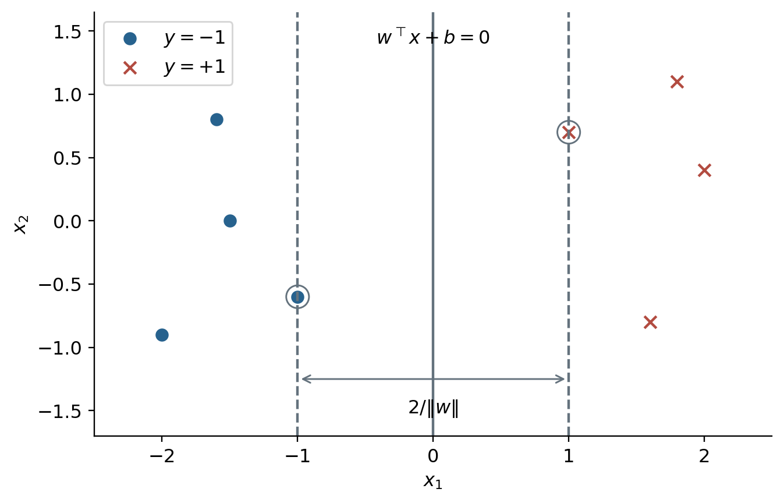
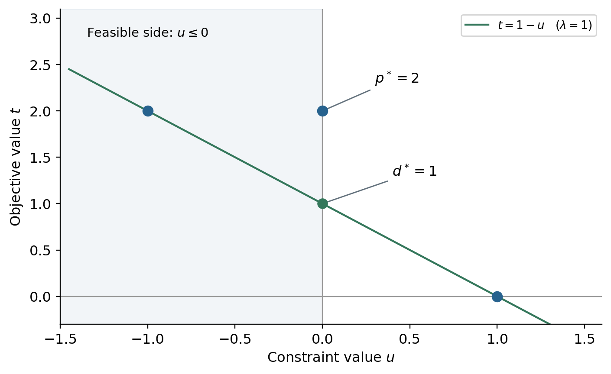
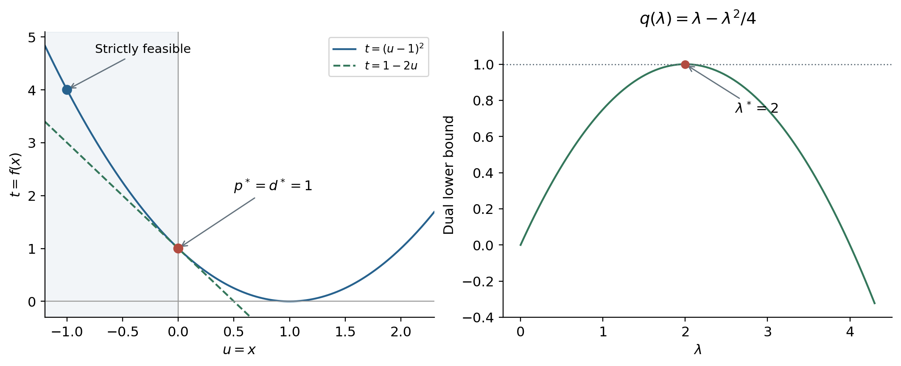
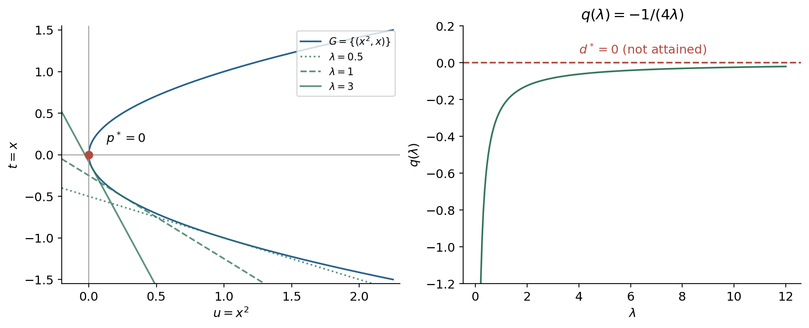

# 支持向量机与核方法 {#sec-svm-kernels}

<!-- 来源：纸质稿 219–222、originVSdual.jpg、cheatsheet.md。核方法和软间隔对偶为补充展开。 -->

SVM 的三条主线是**间隔、对偶、核技巧**。本章先把“分得更稳”写成优化问题，再解释为什么对偶能够求解它，最后推广到不可分数据和非线性边界。

## 从几何间隔到硬间隔 SVM

设 $y_i\in\{-1,+1\}$，分类超平面为 $w^\top x+b=0$，$w\ne0$。样本到超平面的距离为

$$
\frac{|w^\top x_i+b|}{\|w\|_2}.
$$

当所有点正确分类时，绝对值可写成 $y_i(w^\top x_i+b)$。训练集的几何间隔就是最近样本的距离：

$$
\gamma(w,b)=\min_i\frac{y_i(w^\top x_i+b)}{\|w\|_2}.
$$

这里对样本下标 $i$ 取最小值；参数 $w,b$ 在外层选择。线性可分时，目标是最大化这个最小距离。

### 为什么可以把最小函数间隔设为 1

同时将 $(w,b)$ 乘以正数 $c$，超平面与几何间隔都不改变。设某分离参数满足

$$
r=\min_i y_i(w^\top x_i+b)>0.
$$

用 $(w/r,b/r)$ 表示同一超平面，就得到最小函数间隔为 1。于是最大化几何间隔等价于

$$
\min_{w,b}\frac12\|w\|_2^2
\quad\text{使得}\quad y_i(w^\top x_i+b)\ge1\quad(i=1,\ldots,N).
$$

最优解处至少有一个约束取等号，否则还能共同缩小参数，降低目标。两条间隔边界分别为 $w^\top x+b=\pm1$；单侧间隔为 $1/\|w\|$，总宽度为 $2/\|w\|$。

{#fig-svm-margin width=82%}

## 拉格朗日函数、原问题与对偶问题

将约束写成 $g_i(w,b)=1-y_i(w^\top x_i+b)\le0$，引入 $\alpha_i\ge0$：

$$
\mathcal L(w,b,\alpha)=\frac12w^\top w+
\sum_i\alpha_i[1-y_i(w^\top x_i+b)].
$$

### 原问题为何是先对乘子取上确界

固定 $w,b$。若它可行，每项 $\alpha_i g_i\le0$，选择 $\alpha=0$ 使上确界等于原目标。若某个约束 $g_i>0$，令对应乘子趋于正无穷，上确界就是 $+\infty$。因此

$$
p^*=\inf_{w,b}\sup_{\alpha\ge0}\mathcal L(w,b,\alpha).
$$

定义对偶函数与对偶最优值：

$$
q(\alpha)=\inf_{w,b}\mathcal L(w,b,\alpha),\qquad
 d^*=\sup_{\alpha\ge0}q(\alpha).
$$

使用 $\inf,\sup$ 是为了允许最优值无法在有限参数处取得；确认可取到时才写 $\min,\max$。

### 弱对偶：下界永远不超过原问题最优值

对任意原问题可行点 $(w,b)$ 和任意 $\alpha\ge0$：

$$
q(\alpha)\le\mathcal L(w,b,\alpha)\le\frac12\|w\|^2.
$$

左边先对乘子取上确界，右边再对可行点取下确界，得到

$$
d^*\le p^*.
$$

这不要求原问题凸，也不要求最优值达到。原稿用“先在各组中选小的，再从中选大的”帮助记忆极大极小关系；严格依据是上述对任意可行点成立的不等式。

## 对偶的几何解释：读懂原稿中的图

先考虑一个约束的通用问题

$$
\inf_{x\in D}f(x)\quad\text{使得}\quad m(x)\le0.
$$

引入约束值和目标值坐标

$$
u=m(x),\qquad t=f(x),\qquad
G=\{(m(x),f(x)):x\in D\}.
$$

图的横轴是**约束值**，纵轴是**目标值**，不是输入数据的两个特征。原问题最优值是 $G$ 中位于 $u\le0$ 一侧的最低纵坐标：

$$
p^*=\inf\{t:(u,t)\in G,\ u\le0\}.
$$

固定乘子 $\lambda\ge0$，

$$
q(\lambda)=\inf_{(u,t)\in G}(t+\lambda u).
$$

等值线 $t+\lambda u=c$ 是斜率为 $-\lambda$ 的直线。由下向上移动它，使整条直线仍不高于 $G$ 的任一点，最大可达到的截距就是 $q(\lambda)$。对偶问题进一步选择斜率，尽量抬高这个截距。

对可行点 $u\le0$，有 $t\ge q(\lambda)-\lambda u\ge q(\lambda)$，因此截距是原问题的下界。

{#fig-duality-gap width=83%}

为使图意可以核算，取 $G=\{(-1,2),(0,2),(1,0)\}$。这相当于一个有三个候选点的非凸问题：

$$
p^*=2,\quad q(\lambda)=\min\{2-\lambda,2,\lambda\}.
$$

在 $\lambda=1$ 时下界最大，为 $d^*=1$。这里存在严格可行点 $u=-1$，却仍有间隙，说明**没有凸性，仅有严格可行点不足以保证强对偶**。

## Slater 条件：为什么“留有余地”有帮助

### 条件的准确表述

考虑凸优化问题

$$
\min_{x\in D}f_0(x)
\quad\text{使得}\quad f_i(x)\le0\ (i=1,\ldots,m),\quad Ax=b,
$$

其中 $f_0,f_i$ 为凸函数，等式约束是仿射的。标准 Slater 条件要求存在

$$
\bar x\in\operatorname{relint}(D),\qquad
f_i(\bar x)<0\ \text{对所有 }i,\qquad A\bar x=b.
$$

$D$ 是相关函数的公共定义域，$\operatorname{relint}$ 是相对内部：在定义域自身的仿射空间里考虑内部，而不要求在整个环境空间中包含一个球。等式始终要精确满足，不改成严格不等式。

在上述凸性与 Slater 条件下，强对偶成立；若原问题最优值有限，还能保证存在取得对偶最优值的乘子。该条件是充分条件，并非强对偶的必要条件。

当部分 $f_i$ 是仿射函数时，**放宽的 Slater 条件**只要求非仿射不等式严格满足，仿射不等式可以非严格满足；仍需公共定义域相对内部和等式约束条件。目标函数本身不要求严格凸。

### 几何上究竟排除了什么

原稿把严格可行点理解为“有一处真正进入了约束内部”。在单不等式图中，它表现为存在 $u<0$ 的可达点。

需要注意：即使原问题是凸问题，精确像集 $G=\{(m(x),f(x))\}$ 也不一定是凸集。用于分离论证的是其向上、向右扩展的集合

$$
\mathcal A=\{(u,t):\exists x\in D,\ m(x)\le u,\ f(x)\le t\}.
$$

凸性保证这个扩展集合凸。严格可行性帮助排除只含约束方向、无法正规化为目标系数 1 的退化分离超平面。由此可以得到有限斜率的支持关系，令对偶下界达到原最优值。图解服务于直觉，不能把“有支撑线”本身当作未附条件的证明。

### 有 Slater 条件的具体例子

**补充例子：**

$$
\min_x(x-1)^2\quad\text{使得}\quad x\le0.
$$

$\bar x=-1$ 严格可行；最优点为 $x^*=0$，$p^*=1$。对偶函数通过配方得到：

$$
\begin{aligned}
q(\lambda)&=\inf_x[(x-1)^2+\lambda x]\\
&=\inf_x\left[x-(1-\lambda/2)\right]^2
+\lambda-\lambda^2/4\\
&=\lambda-\lambda^2/4.
\end{aligned}
$$

在 $\lambda^*=2$ 达到最大值 $1$。图中 $u=x,t=(u-1)^2$；直线 $t=1-2u$ 在 $(0,1)$ 处支撑抛物线，其截距恰好为 $p^*=d^*=1$。

{#fig-slater width=98%}

严格可行点不需要是最优点。将“最优解在边界上”误认为“不满足 Slater”，是很容易产生的混淆。

### 不满足 Slater，不等于必有对偶间隙

**补充反例：**

$$
\min_x x\quad\text{使得}\quad x^2\le0.
$$

唯一可行点为 $x=0$，所以 $p^*=0$，但不存在 $x^2<0$。对于 $\lambda>0$，

$$
q(\lambda)=\inf_x(x+\lambda x^2)=-\frac1{4\lambda};
\qquad q(0)=-\infty.
$$

于是 $d^*=\sup_{\lambda\ge0}q(\lambda)=0=p^*$，但没有有限的最优乘子，只有 $\lambda\to\infty$ 时逼近。

{#fig-no-slater width=98%}

这也解释了原稿边注中的“$\lambda\to+\infty$”：它可以表示**对偶最优值不取到**，不必然表示正对偶间隙。

### 为什么硬间隔 SVM 满足条件

有限样本线性可分时，存在 $(w_0,b_0)$，使 $r=\min_i y_i(w_0^\top x_i+b_0)>0$。取 $c>1/r$，则

$$
y_i(cw_0^\top x_i+cb_0)>1\quad\text{对所有 }i.
$$

因此每个不等式都严格满足。目标为凸二次函数，约束是仿射函数，定义域为整个参数空间，故强对偶成立。

## KKT 条件与硬间隔对偶的求解

### 四组条件

对于可微的凸问题，一组原始变量与乘子满足 KKT 条件时，足以证明全局最优；Slater 等约束资格条件使 KKT 也成为最优解的必要条件。

在 SVM 中，KKT 写成：

$$
\begin{aligned}
&y_i(w^\top x_i+b)\ge1 &&\text{原始可行性},\\
&\alpha_i\ge0 &&\text{对偶可行性},\\
&\alpha_i[1-y_i(w^\top x_i+b)]=0 &&\text{互补松弛},\\
&w-\sum_i\alpha_iy_ix_i=0,\quad\sum_i\alpha_iy_i=0 &&\text{驻点条件}.
\end{aligned}
$$

互补松弛可以从强对偶推导。对原始、对偶最优解：

$$
d^*=\inf_{w,b}\mathcal L(w,b,\alpha^*)
\le\mathcal L(w^*,b^*,\alpha^*)\le f_0(w^*,b^*)=p^*.
$$

若 $p^*=d^*$，两处不等式必须取等号。由于每个 $\alpha_i^*g_i(w^*,b^*)\le0$，而它们之和为零，每一项都只能为零。第一处等号说明原始最优点同时最小化固定乘子下的拉格朗日函数，得到驻点条件。

### 消去 $w,b$

固定 $\alpha$，对 $b$ 求导得到 $\sum_i\alpha_i y_i=0$；若不满足，该线性项可使下确界为 $-\infty$。

对 $w$ 求导得到 $w=\sum_i\alpha_i y_i x_i$。代入原式：

$$
q(\alpha)=\sum_i\alpha_i
-\frac12\sum_{i,j}\alpha_i\alpha_jy_iy_jx_i^\top x_j.
$$

故对偶问题为

$$
\begin{aligned}
\max_\alpha\quad&\sum_i\alpha_i
-\frac12\sum_{i,j}\alpha_i\alpha_jy_iy_jx_i^\top x_j,\\
\text{使得}\quad&\alpha_i\ge0,\qquad\sum_i\alpha_i y_i=0.
\end{aligned}
$$

等式约束不能省略。

### 支持向量与偏置

得到 $\alpha^*$ 后，

$$
w^*=\sum_i\alpha_i^*y_ix_i.
$$

若 $\alpha_k^*>0$，互补松弛给出 $y_k(w^{*\top}x_k+b^*)=1$，利用 $y_k^2=1$ 得到

$$
b^*=y_k-w^{*\top}x_k.
$$

可以对多个满足条件的支持向量计算偏置后取平均，以减轻数值误差。$\alpha_i>0$ 蕴含点在间隔边界上；反过来，退化情况下边界点的乘子可能为零，不应将这两句话无条件等同。

## 软间隔：允许违反间隔

真实数据可能不可分。令 $z_i=y_i(w^\top x_i+b)$，hinge loss 为

$$
\ell_{\mathrm{hinge}}(z_i)=\max\{0,1-z_i\}.
$$

它惩罚的不仅是误分类点，还包括正确分类但离边界太近的点。原稿的 $\mathbf1\{z_i<1\}$ 应称为间隔违约指示损失；通常的分类 0–1 损失使用阈值 0。

软间隔的无约束目标为

$$
\min_{w,b}\frac12\|w\|^2+C\sum_i\max\{0,1-y_i(w^\top x_i+b)\},\qquad C>0.
$$

此处不能再附加硬间隔约束，否则所有 hinge 项都被强制为零。引入松弛变量得到等价形式：

$$
\begin{aligned}
\min_{w,b,\xi}\quad&\frac12\|w\|^2+C\sum_i\xi_i,\\
\text{使得}\quad&y_i(w^\top x_i+b)\ge1-\xi_i,\qquad\xi_i\ge0.
\end{aligned}
$$

固定 $w,b$，由于目标随 $\xi_i$ 严格递增，最优时 $\xi_i=\max\{0,1-z_i\}$，而不是对所有样本写成 $\xi_i=1-z_i$。

### 软间隔对偶与乘子的含义（补充推导）

为 $1-\xi_i-z_i\le0$ 引入 $\alpha_i\ge0$，为 $-\xi_i\le0$ 引入 $\mu_i\ge0$。对 $\xi_i$ 的驻点条件为

$$
C-\alpha_i-\mu_i=0\quad\Longrightarrow\quad0\le\alpha_i\le C.
$$

其余驻点条件与硬间隔相同，因此对偶目标不变，约束变为

$$
0\le\alpha_i\le C,\qquad\sum_i\alpha_i y_i=0.
$$

| 乘子 | KKT 推出的情况 |
|---|---|
| $\alpha_i=0$ | $\xi_i=0$，$z_i\ge1$ |
| $0<\alpha_i<C$ | $\xi_i=0$，$z_i=1$，可用于直接计算 $b$ |
| $\alpha_i=C$ | $z_i=1-\xi_i\le1$，可能在间隔内，也可能误分类 |

如果没有 $0<\alpha_i<C$ 的点，需根据 KKT 的不等式确定偏置区间，不能随意取一个 $\alpha_i=C$ 的点套用硬间隔公式。

## 核技巧：只计算特征空间的内积

**补充整理：原稿仅给出核方法概述，本节补足本章主线。**

设特征映射 $\varphi(x)$ 把输入送入某个内积空间。对偶目标和预测只依赖 $\langle\varphi(x_i),\varphi(x_j)\rangle$，因此定义

$$
k(x,x')=\langle\varphi(x),\varphi(x')\rangle.
$$

将对偶中的 $x_i^\top x_j$ 换成 $k(x_i,x_j)$ 即可。预测为

$$
\hat y(x)=\operatorname{sign}\!\left[\sum_i\alpha_i^*y_i k(x_i,x)+b^*\right].
$$

核函数让我们隐式使用特征空间，不必显式构造所有坐标。

### 合法核的条件

对实值对称函数，标准正定核条件是：对任意有限点集，Gram 矩阵 $K_{ij}=k(x_i,x_j)$ 均半正定，即 $c^\top Kc\ge0$ 对任意 $c$ 成立。仅仅“对称”或“函数值为正”都不够。

常见核为

$$
\begin{aligned}
 k(x,x')&=x^\top x' &&\text{线性核},\\
 k(x,x')&=(x^\top x'+c)^d, c\ge0, d\in\mathbb N^+ &&\text{多项式核},\\
 k(x,x')&=\exp[-\|x-x'\|^2/(2s^2)],\ s>0 &&\text{高斯核}.
\end{aligned}
$$

例如二维二次齐次核对应

$$
\varphi(x)=(x_1^2,\sqrt2x_1x_2,x_2^2)^\top,qquad
\varphi(x)^\top\varphi(x')=(x^\top x')^2.
$$

必须掌握的关系是：**几何间隔给出原问题，强对偶支持对偶求解，KKT 解释支持向量，对偶中的内积结构使核化成为可能。**
