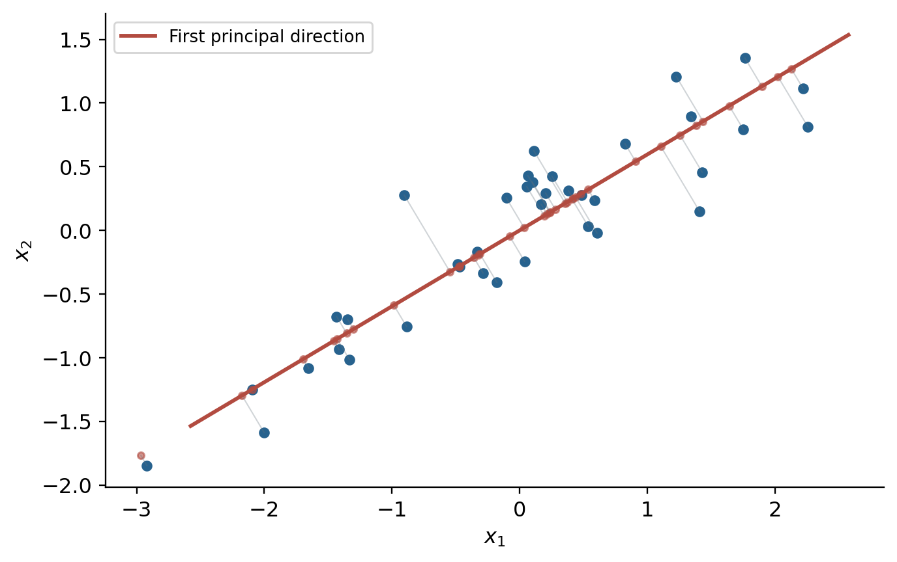

# 主成分分析 {#sec-pca}

<!-- 来源：63fd6436-785b-4637-9813-6c7e61cdfe47.md、cheatsheet.md。 -->

降维希望用较少坐标保留数据中重要的变化。它可以降低存储和计算成本，也可能减轻估计困难；但若丢掉与任务相关的信息，预测反而会变差，因此不能把降维称为普遍“最好”的防过拟合方法。

## 高维直觉与降维方法

半径 $R$ 的 $p$ 维球体积为 $V_pR^p$，其中 $V_p=\pi^{p/2}/\Gamma(p/2+1)$。它与外接超立方体的体积之比为

$$
\frac{V_pR^p}{(2R)^p}=\frac{\pi^{p/2}}{2^p\Gamma(p/2+1)}\longrightarrow0
\quad(p\to\infty).
$$

原稿中的极限下标应为维度趋于无穷，常数 $V_p$ 也依赖维度。这个例子说明高维几何与低维直觉不同；它本身不能证明任意真实数据都集中在立方体边界上。

降维可以是特征选择，也可以是构造新坐标。PCA 是线性降维；经典 MDS/PCoA 从距离或 Gram 矩阵构造坐标；Isomap、LLE 等流形方法处理更一般的非线性结构。本章重点是 PCA。

## 中心化与协方差矩阵

仍用 $X\in\mathbb R^{N\times p}$ 表示按行排列的数据。令 $\mathbf1\in\mathbb R^N$ 为全 1 向量：

$$
H=I_N-\frac1N\mathbf1\mathbf1^\top,\qquad
X_c=HX,
\qquad\bar x=\frac1N\sum_ix_i.
$$

$X_c$ 的第 $i$ 行是 $(x_i-\bar x)^\top$。由 $\mathbf1^\top\mathbf1=N$：

$$
H^\top=H,\qquad
H^2=I_N-\frac2N\mathbf1\mathbf1^\top
+\frac1{N^2}\mathbf1(\mathbf1^\top\mathbf1)\mathbf1^\top=H.
$$

所以 $H$ 是投影到 $\mathbf1^\perp$ 的正交投影矩阵。经验协方差为

$$
S=\frac1N\sum_i(x_i-\bar x)(x_i-\bar x)^\top
=\frac1NX_c^\top X_c=\frac1NX^\top HX.
$$

使用 $1/(N-1)$ 会改变特征值尺度，不改变主成分方向。

## 最大方差视角

### 一个投影方向

对单位向量 $u$，中心化后的投影坐标为 $z_i=u^\top(x_i-\bar x)$，均值为零，方差为

$$
\frac1N\sum_i z_i^2=u^\top Su.
$$

因此第一主成分求解

$$
\max_{u^\top u=1}u^\top Su.
$$

构造 $\mathcal L(u,\lambda)=u^\top Su-\lambda(u^\top u-1)$，驻点条件为

$$
2Su-2\lambda u=0\quad\Longrightarrow\quad Su=\lambda u.
$$

若 $S$ 的特征值按 $\lambda_1\ge\cdots\ge\lambda_p\ge0$ 排列，最大值是 $\lambda_1$，方向是其对应单位特征向量。

### 多个投影方向

令 $U_q=(u_1,\ldots,u_q)\in\mathbb R^{p\times q}$。必须同时要求**正交归一**：

$$
\max_{U_q^\top U_q=I_q}\operatorname{tr}(U_q^\top SU_q)
=\max\sum_{j=1}^qu_j^\top Su_j.
$$

只要求每个向量长度为 1 或“线性无关”都不够；分别独立最大化会重复选同一最大特征方向。正交约束下选择前 $q$ 个特征向量，最大值为 $\sum_{j=1}^q\lambda_j$。

## 最小重构误差视角

正交完备基允许将中心化样本展开为

$$
x_i-\bar x=\sum_{j=1}^p[u_j^\top(x_i-\bar x)]u_j.
$$

保留前 $q$ 项得到重构

$$
\hat x_i=\bar x+U_qU_q^\top(x_i-\bar x).
$$

利用正交性，残差平方为剩余坐标的平方和：

$$
\begin{aligned}
\frac1N\sum_i\|x_i-\hat x_i\|^2
&=\frac1N\sum_i\sum_{j=q+1}^p[u_j^\top(x_i-\bar x)]^2\\
&=\operatorname{tr}(S)-\operatorname{tr}(U_q^\top SU_q).
\end{aligned}
$$

总方差固定，所以最小重构误差与最大保留方差是同一问题。最小误差是 $\sum_{j=q+1}^p\lambda_j$。

{#fig-pca width=82%}

## SVD 与主坐标分析

### 直接分解中心化数据

采用紧致 SVD：$X_c=UDV^\top$，$D$ 的对角元为 $d_1\ge\cdots\ge d_r>0$。则

$$
S=\frac1NV D^2V^\top.
$$

因此右奇异向量 $V$ 给出特征方向，$\lambda_j=d_j^2/N$。降维坐标为

$$
Z=X_cV_q=U_qD_q,
$$

其中此式的 $U_q$ 指左奇异向量的前 $q$ 列，区别于上一节通用的投影基记号。原数据的重构为 $\mathbf1\bar x^\top+ZV_q^\top$。

### 从样本 Gram 矩阵得到坐标

定义

$$
T=X_cX_c^\top=HXX^\top H=UD^2U^\top.
$$

若其前 $q$ 个正特征值为 $\rho_j=d_j^2$，对应向量构成 $U_q$，则坐标为 $U_q\operatorname{diag}(\sqrt{\rho_1},\ldots,\sqrt{\rho_q})$。

$S$ 是 $p\times p$，$T$ 是 $N\times N$。当 $N\ll p$ 时，从后者求解可能更方便。补充：经典 PCoA 常从平方距离矩阵 $D^{(2)}$ 出发，双中心化得到 $T=-\tfrac12HD^{(2)}H$；对于欧氏距离，这与中心化数据的 Gram 矩阵一致。

## 概率 PCA：保留原稿的概率视角

设 $z\in\mathbb R^q$ 为低维隐变量：

$$
z\sim\mathcal N(0,I_q),\quad
x=Wz+\mu+\varepsilon,\quad
\varepsilon\sim\mathcal N(0,\sigma^2I_p),
$$

并假设 $z,\varepsilon$ 独立。于是

$$
\mathbb E[x]=\mu,\qquad
\operatorname{Cov}(x)=WW^\top+\sigma^2I_p=C.
$$

$\operatorname{Cov}(z,x)=W^\top$，因此联合高斯的条件分布公式给出

$$
p(z\mid x)=\mathcal N\!\left(W^\top C^{-1}(x-\mu),\ I_q-W^\top C^{-1}W\right).
$$

学习 $W,\mu,\sigma^2$ 可以使用 EM，见 @sec-em-gmm；推断则用后验均值作为低维表示，并可保留后验协方差描述不确定性。这一视角说明 PCA 与隐变量模型的联系，本章不展开完整 PPCA 的 EM 更新。

## 使用时的边界

PCA 保留的是输入方差，不保证保留对标签最有用的信息。特征量纲差异较大时，需要决定是否标准化；这是改变问题权重的建模选择。若特征值重复，对应子空间可能唯一，但子空间内的基不唯一。累计解释方差比为 $\sum_{j\le q}\lambda_j/\sum_j\lambda_j$，可辅助选择维数。
