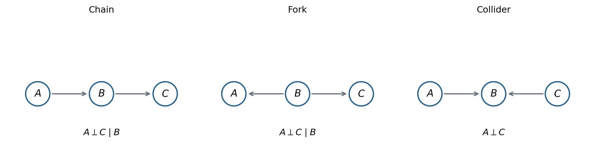
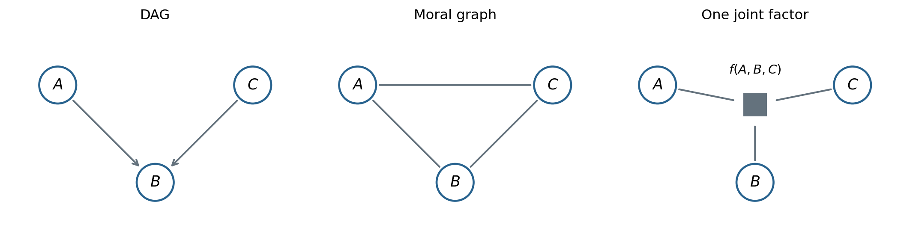

# 概率图模型 {#sec-probabilistic-graphical-models}

<!-- 来源：7.PGMIntro.md、16.GaussianNetwork.md、cheatsheet.md；架构外模型只作联系。 -->

高维联合分布难以直接表示和计算。概率图模型用图表达分解结构与条件独立性，使局部计算成为可能。节点代表随机变量；边表达依赖结构，边本身一般不是一个“条件概率数值”。

## 表示、推断与学习

基本概率规则为

$$
\begin{aligned}
p(x_1)&=\int p(x_1,x_2)dx_2,\\
p(x_1,x_2)&=p(x_1\mid x_2)p(x_2),\\
p(x_1,\ldots,x_p)&=\prod_{i=1}^pp(x_i\mid x_1,\ldots,x_{i-1}),\\
p(x_1\mid x_2)&=\frac{p(x_2\mid x_1)p(x_1)}{p(x_2)}.
\end{aligned}
$$

链式法则总成立，图模型通过条件独立假设减少各因子所需条件变量。$X_A\perp X_B\mid X_C$ 表示给定 $X_C$ 后两组变量条件独立。

| 任务 | 主要问题 |
|---|---|
| 表示 | 联合分布怎样分解，哪些条件独立关系被编码 |
| 推断 | 求边缘、条件分布或最可能的变量配置 |
| 学习 | 估计参数，或从数据中学习结构；缺失数据可使用 EM |

有向/无向是图结构分类，离散/连续是变量类型分类，二者可以组合；不能把有向图限定为离散变量。MAP 推断也不只针对参数，可以针对隐变量或结构化输出。

## 有向无环图：贝叶斯网络

给定一个 DAG，按父节点分解：

$$
p(x_1,\ldots,x_p)=\prod_i p(x_i\mid x_{\operatorname{pa}(i)}).
$$

拓扑排序保证父节点先于子节点。仅给定一个一般联合分布并不会唯一确定 DAG；图同时表达建模假设。

### 三种局部结构

{#fig-dag-motifs width=98%}

链结构 $A\to B\to C$：$p(a,b,c)=p(a)p(b\mid a)p(c\mid b)$，因此

$$
p(a,c\mid b)=p(a\mid b)p(c\mid b),\qquad A\perp C\mid B.
$$

分叉结构 $A\leftarrow B\to C$：$p(a,b,c)=p(b)p(a\mid b)p(c\mid b)$，同样有 $A\perp C\mid B$。

碰撞结构 $A\to B\leftarrow C$：$p(a,b,c)=p(a)p(c)p(b\mid a,c)$。对 $b$ 求和得到 $p(a,c)=p(a)p(c)$，故 $A\perp C$；但给定 $B$ 后，$A,C$ 通常会相关，这就是 explaining away 的来源。这里并不是说 $A$ 或 $C$ 与 $B$ 条件独立。

### d-separation：从局部规则到整条路径

忽略箭头方向观察一条路径。给定集合 $S$，路径在以下任一种情形下被阻断：

1. 路径上有非碰撞节点属于 $S$；
2. 路径上有碰撞节点，而且它自身及其所有后代都不在 $S$。

若 $A$ 与 $B$ 之间每条路径都被 $S$ 阻断，则图蕴含 $X_A\perp X_B\mid X_S$。碰撞节点的后代被观测也可能打开路径，不能遗漏这个条件。

图没有蕴含某个独立关系，不代表所有参数选择下变量必然相关；特殊参数可能产生额外独立性。

### Markov 毯

求一个变量在其他变量给定时的条件分布：

$$
p(x_i\mid x_{-i})\propto
p(x_i\mid x_{\operatorname{pa}(i)})
\prod_{j\in\operatorname{ch}(i)}p(x_j\mid x_{\operatorname{pa}(j)}).
$$

因为联合分布里其他不含 $x_i$ 的因子在归一化时消掉。相关变量包括父节点、子节点以及子节点的其他父节点；这三类合称 Markov 毯。原稿只写 $p(x_{\mathrm{child}(i)}\mid x_i)$，省掉共同父节点后会误解依赖关系。

## 无向图：马尔可夫随机场

无向图直接用图分隔表达条件独立，不使用 DAG 的碰撞节点规则。常见性质为：

- 全局 Markov：若 $S$ 分隔 $A,B$，则 $X_A\perp X_B\mid X_S$。
- 局部 Markov：给定邻居后，一个节点独立于其他非邻居节点。
- 成对 Markov：两个不相邻节点在其余所有节点给定后独立。

全局性质蕴含局部与成对性质；在标准严格正分布等条件下三者等价。省去正性等条件而直接声称等价并不严谨。

### 团与因子分解

团是两两相连的节点集合；不能再加入节点的团称为**极大团**（maximal clique），与“节点数最多的最大团”不同。

对严格正分布，Hammersley–Clifford 定理将图的 Markov 性质与团因子分解联系起来：

$$
p(x)=\frac1Z\prod_{C}\psi_C(x_C),\qquad
Z=\sum_x\prod_C\psi_C(x_C).
$$

连续情形用积分替代求和，并要求 $Z$ 有限。正势函数可写成 $\psi_C=\exp[-E_C]$，因此

$$
p(x)=\frac1Z\exp\left[-\sum_CE_C(x_C)\right].
$$

这称为 Gibbs 形式。它与指数族相关；若要赋予最大熵解释，还须明确支持集和期望约束，而不只是观察到指数符号。

## 从有向图到道德图，再到因子图

把 DAG 转为道德图的步骤是：先将每个节点的父节点两两相连，再去掉所有箭头。链和分叉只需去箭头；碰撞结构需要把两位父节点相连，因为 $p(b\mid a,c)$ 同时涉及三个变量。

道德化可以保留该分布的某种无向因子表示，但不保证保留全部条件独立关系。碰撞结构中的 $A\perp C$ 在道德图中就不再由分隔表达。

因子图把变量节点与因子节点区分开。若

$$
p(x)\propto\prod_s f_s(x_s),
$$

则变量与包含它的因子相连。例如一个三变量因子 $f(a,b,c)$ 可以用一个因子节点连接三个变量，形成星形图。

{#fig-moral-factor width=98%}

但将分布画成因子图**不保证无环**。若保留三个不同的两变量因子 $f_{ab}f_{bc}f_{ac}$，对应因子图仍有环；把它们合成一个大因子虽然改变图形，却可能把计算困难放入大因子表中。

## 变量消除：调整求和顺序

考虑链 $a\to b\to c\to d$：

$$
\begin{aligned}
p(d)&=\sum_{a,b,c}p(a)p(b\mid a)p(c\mid b)p(d\mid c)\\
&=\sum_c p(d\mid c)\sum_b p(c\mid b)\sum_a p(b\mid a)p(a).
\end{aligned}
$$

从内向外计算时，每一步只构造需要的中间因子，避免枚举全部联合配置。变量消除可以用于一般图，并不只适用于树；复杂度由消除次序产生的中间因子大小决定，最优次序的寻找通常很困难。

原稿所谓“计算步骤无法存储”应理解为：朴素地对每个查询重新做消除会重复计算；算法本身当然可以缓存中间结果。消息传递系统地组织了这种复用。

## 树上的信念传播：sum-product

考虑两两势函数构成的树：

$$
p(x)=\frac1Z\prod_i\psi_i(x_i)\prod_{(i,j)\in E}\psi_{ij}(x_i,x_j).
$$

从节点 $j$ 发往相邻节点 $i$ 的消息为

$$
m_{j\to i}(x_i)=\sum_{x_j}\psi_j(x_j)\psi_{ij}(x_i,x_j)
\prod_{k\in\mathcal N(j)\setminus\{i\}}m_{k\to j}(x_j).
$$

发送时先收集除接收者之外的所有入消息，再将发送者变量求和消去。若 $j$ 是叶节点，乘积为空，取 1。

### 原稿中的四节点例子

设边为 $(a,b),(b,c),(b,d)$。先从叶节点计算

$$
m_{c\to b}(b)=\sum_c\psi_c(c)\psi_{bc}(b,c),\quad
m_{d\to b}(b)=\sum_d\psi_d(d)\psi_{bd}(b,d).
$$

再向 $a$ 发消息：

$$
m_{b\to a}(a)=\sum_b\psi_b(b)\psi_{ab}(a,b)
m_{c\to b}(b)m_{d\to b}(b).
$$

最后

$$
p(a)=\frac{\psi_a(a)m_{b\to a}(a)}{\sum_{a'}\psi_a(a')m_{b\to a}(a')}.
$$

一般边缘概率为 $p(x_i)\propto\psi_i(x_i)\prod_{j\in\mathcal N(i)}m_{j\to i}(x_i)$，最终需要归一化。

选一个根，先从叶到根收集，再从根向叶分发，即可得到全部单点边缘。在树上是精确计算；有环时迭代的 loopy BP 不保证收敛或精确。

对没有任何观测证据的有向链，从后代反向求和得到的因子可为 1；不能凭空再乘一个末端边缘概率 $p(e)$。有观测时，证据通过局部似然因子进入消息。

## Max-product 与联合最优配置

如果需要最可能的联合状态，树上的消息可将求和替换成最大值：

$$
m_{j\to i}(x_i)=\max_{x_j}\psi_j(x_j)\psi_{ij}(x_i,x_j)
\prod_{k\in\mathcal N(j)\setminus\{i\}}m_{k\to j}(x_j).
$$

还必须保存每一步取最大值的状态，在根节点决策后沿树回溯。分别最大化各节点边缘，不保证得到联合概率最大的配置。取对数可得到 max-sum；HMM 中的 Viterbi 是链结构上的对应算法。

Junction tree 将变量聚成团，在团树上传递消息来处理一般图；复杂度可能随树宽指数增长。近似方法包括 loopy BP、VI、Monte Carlo 等，附录介绍 MCMC。

## 高斯图模型

### 联合高斯是前提

设 $x\sim\mathcal N(\mu,\Sigma)$ 且 $\Sigma\succ0$。不能仅从“每个节点边缘都是高斯”推出联合高斯；本节把联合高斯作为模型假设，或由线性高斯结构方程推导它。

记精度矩阵 $\Lambda=\Sigma^{-1}$：

$$
\begin{aligned}
x_i\perp x_j&\Longleftrightarrow\Sigma_{ij}=0,\\
x_i\perp x_j\mid x_{-\{i,j\}}&\Longleftrightarrow\Lambda_{ij}=0.
\end{aligned}
$$

第一条是边缘独立，不应称为图上的“全局 Markov 性”。

### 从精度矩阵得到条件分布

对联合密度指数保留与 $x_i$ 有关的项，并配方：

$$
x_i\mid x_{-i}\sim\mathcal N\left(
\mu_i-\frac1{\Lambda_{ii}}\sum_{j\ne i}\Lambda_{ij}(x_j-\mu_j),
\frac1{\Lambda_{ii}}\right).
$$

原稿漏写了均值平移和负号。精度矩阵某项为零，就不会在这个条件均值中出现对应变量。

### 高斯贝叶斯网络：结构方程

用独立噪声 $\varepsilon_i\sim\mathcal N(0,1)$ 表示

$$
x_i-\mu_i=\sum_{j\in\operatorname{pa}(i)}w_{ij}(x_j-\mu_j)+s_i\varepsilon_i.
$$

矩阵形式为 $x-\mu=W(x-\mu)+S\varepsilon$，其中 $S=\operatorname{diag}(s_i)$。DAG 按拓扑顺序排列后 $W$ 严格下三角，$I-W$ 可逆，所以

$$
\Sigma=(I-W)^{-1}S^2(I-W)^{-\top}.
$$

### 高斯马尔可夫网络：二次型与边

展开密度并令 $h=\Lambda\mu$：

$$
p(x)\propto\exp\left[-\frac12x^\top\Lambda x+h^\top x\right].
$$

节点项为 $-\tfrac12\Lambda_{ii}x_i^2+h_ix_i$，每个无向变量对 $i<j$ 的项为 $-\Lambda_{ij}x_ix_j$。对称性使交叉项合并，不能再对有序对重复计数。由此再次看出精度矩阵的零元素对应缺失边。

## 主线模型之间的联系

朴素贝叶斯用给定类别后的特征独立性简化联合分布；GMM 用隐分量解释多峰；HMM 把隐状态沿时间串联；CRF 直接对给定输入后的标签分布建模。图不仅用于展示模型，也决定可以如何分解计算、传递消息和组织学习。
