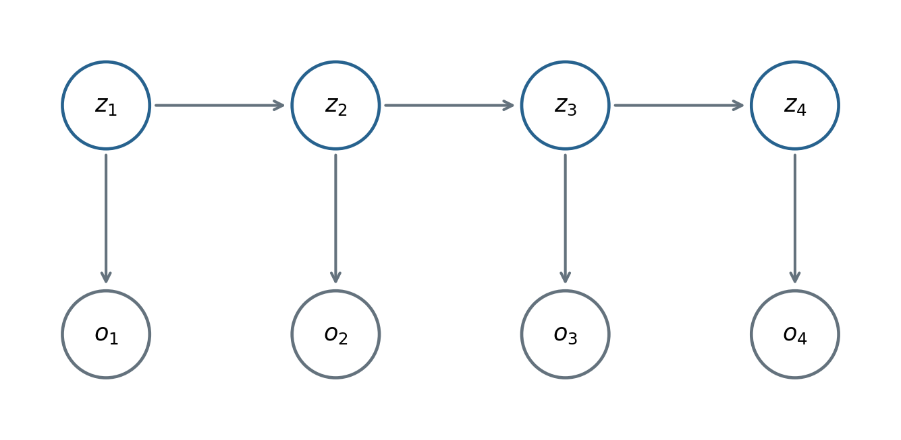

# 隐马尔可夫模型 {#sec-hmm}

<!-- 来源：12.HMM.md、cheatsheet.md。Baum–Welch 的转移/发射更新与边界条件为补充；13.LDS.md、14.particleFilter.md 仅用于最后的联系。 -->

GMM 用一个隐类别解释一个观测。若隐状态随着时间变化，并使相邻观测产生依赖，就进入状态空间模型。HMM 使用离散隐状态；观测可以是离散或连续的。本章先采用离散观测，便于写出完整递推。

## 模型、参数与假设

令隐状态 $z_t\in\{1,\ldots,K\}$，观测 $o_t\in\{v_1,\ldots,v_M\}$，序列长度为 $T$。参数为 $\theta=(\pi,A,B)$：

$$
\pi_j=P(z_1=j),\quad
 a_{ij}=P(z_{t+1}=j\mid z_t=i),\quad
 b_j(v)=P(o_t=v\mid z_t=j).
$$

$\pi$、$A$ 的每一行、$B$ 的每一行都归一化。

{#fig-hmm width=96%}

一阶马尔可夫假设是未来状态在给定当前状态后与更早历史独立；齐次性另要求转移核不随时间变化。观测条件独立假设给出

$$
p(o_{1:T}\mid z_{1:T})=\prod_{t=1}^Tp(o_t\mid z_t).
$$

这不表示观测在边缘分布下独立：共享、相关的隐状态仍能使它们相关。

于是联合分布为

$$
p(z_{1:T},o_{1:T}\mid\theta)
=\pi_{z_1}\prod_{t=2}^Ta_{z_{t-1},z_t}\prod_{t=1}^Tb_{z_t}(o_t).
$$

三个核心问题是：求证据概率 $p(o_{1:T}\mid\theta)$，学习参数 $\theta$，以及寻找最可能的联合状态路径。它们分别对应前向/后向算法、Baum–Welch、Viterbi。

## 前向算法：把指数枚举变成递推

直接计算

$$
p(o_{1:T}\mid\theta)=\sum_{z_{1:T}}p(z_{1:T},o_{1:T}\mid\theta)
$$

要枚举 $K^T$ 条隐状态序列。求和对象是隐状态路径，不是已观测到的序列。

定义前向量

$$
\alpha_t(i)=p(o_{1:t},z_t=i\mid\theta).
$$

初始化 $\alpha_1(i)=\pi_i b_i(o_1)$。对下一时刻：

$$
\begin{aligned}
\alpha_{t+1}(j)
&=\sum_i p(o_{1:t+1},z_t=i,z_{t+1}=j\mid\theta)\\
&=\sum_i p(o_{t+1}\mid z_{t+1}=j)
 p(z_{t+1}=j\mid z_t=i)p(o_{1:t},z_t=i\mid\theta)\\
&=b_j(o_{t+1})\sum_i\alpha_t(i)a_{ij}.
\end{aligned}
$$

最后 $p(o_{1:T}\mid\theta)=\sum_j\alpha_T(j)$。共有 $T$ 层、每层 $K^2$ 次量级计算，复杂度降为 $O(TK^2)$。原稿递推末项的 $o_t$ 应改为 $o_{t+1}$。

## 后向算法：从未来观测向前计算

定义

$$
\beta_t(i)=p(o_{t+1:T}\mid z_t=i,\theta).
$$

末端没有未来观测，因此 $\beta_T(i)=1$。对下一隐状态求和：

$$
\begin{aligned}
\beta_t(i)
&=\sum_jp(o_{t+1:T},z_{t+1}=j\mid z_t=i,\theta)\\
&=\sum_j a_{ij}b_j(o_{t+1})\beta_{t+1}(j).
\end{aligned}
$$

证据概率也可写成

$$
p(o_{1:T}\mid\theta)=\sum_i\pi_i b_i(o_1)\beta_1(i).
$$

更一般地，对任意 $t$，$p(o_{1:T}\mid\theta)=\sum_i\alpha_t(i)\beta_t(i)$。

## 滤波、平滑与预测

滤波只使用到当前时刻的观测：

$$
p(z_t=i\mid o_{1:t})=\frac{\alpha_t(i)}{\sum_j\alpha_t(j)}.
$$

平滑使用整条观测序列，包括当前时刻之后的信息：

$$
\gamma_t(i)=p(z_t=i\mid o_{1:T})
=\frac{\alpha_t(i)\beta_t(i)}{\sum_j\alpha_t(j)\beta_t(j)}.
$$

一步状态预测和观测预测分别为

$$
\begin{aligned}
p(z_{t+1}=j\mid o_{1:t})&=\sum_i a_{ij}p(z_t=i\mid o_{1:t}),\\
p(o_{t+1}=v\mid o_{1:t})&=\sum_j b_j(v)p(z_{t+1}=j\mid o_{1:t}).
\end{aligned}
$$

滤波是在线问题，平滑通常在已有整段数据时进行。二者都不等于联合路径解码。

## Baum–Welch：HMM 中的 EM

为区分时间下标 $t$ 和迭代次数，用 $r$ 表示 EM 轮数：

$$
Q(\theta\mid\theta^{(r)})
=\sum_{z_{1:T}}p(z_{1:T}\mid o_{1:T},\theta^{(r)})
\log p(o_{1:T},z_{1:T}\mid\theta).
$$

旧参数下的证据概率与新参数无关，所以在求 $\arg\max_\theta$ 时可整体乘去归一化常数，但 E 步中使用归一化后验更清晰。

### E 步需要哪些统计量

除了单状态后验 $\gamma_t(i)$，还需要相邻状态对的后验：

$$
\xi_t(i,j)=p(z_t=i,z_{t+1}=j\mid o_{1:T},\theta^{(r)})
=\frac{\alpha_t(i)a_{ij}b_j(o_{t+1})\beta_{t+1}(j)}{p(o_{1:T}\mid\theta^{(r)})}.
$$

右边的参数和消息全部用旧参数计算。分子分解为过去、转移、下一个观测和未来四部分。

取完整对数似然的期望后，

$$
\begin{aligned}
Q=&\sum_i\gamma_1(i)\log\pi_i\\
&+\sum_{t=1}^{T-1}\sum_{i,j}\xi_t(i,j)\log a_{ij}\\
&+\sum_{t=1}^{T}\sum_j\gamma_t(j)\log b_j(o_t).
\end{aligned}
$$

### M 步：期望计数归一化

最大化第一项，约束 $\sum_i\pi_i=1$。拉格朗日驻点为 $\gamma_1(i)/\pi_i+\lambda=0$，相乘求和后 $\lambda=-1$，所以

$$
\pi_i^{\mathrm{new}}=\gamma_1(i).
$$

这保留了原稿对初始分布的推导。对每一行转移概率施加相同的归一化约束，得到补充更新

$$
a_{ij}^{\mathrm{new}}
=\frac{\sum_{t=1}^{T-1}\xi_t(i,j)}{\sum_{t=1}^{T-1}\gamma_t(i)}.
$$

分子是从 $i$ 到 $j$ 的期望转移次数，分母是离开 $i$ 的期望机会数。离散发射概率为

$$
b_j^{\mathrm{new}}(v_k)
=\frac{\sum_{t=1}^T\gamma_t(j)\mathbf1\{o_t=v_k\}}{\sum_{t=1}^T\gamma_t(j)}.
$$

多个独立序列时，把相应期望计数跨序列相加，初始分布对各序列起点平均；不能把序列首尾误连。分母为零的状态需要单独处理。

## Viterbi：最可能的完整路径

目标是

$$
\hat z_{1:T}=\arg\max_{z_{1:T}}p(z_{1:T}\mid o_{1:T},\theta).
$$

分母与路径无关，因此最大化联合概率即可。定义

$$
\delta_t(j)=\max_{z_{1:t-1}}p(o_{1:t},z_{1:t-1},z_t=j\mid\theta).
$$

初始化 $\delta_1(j)=\pi_jb_j(o_1)$。递推与回溯指针为

$$
\begin{aligned}
\delta_{t+1}(j)&=b_j(o_{t+1})\max_i[\delta_t(i)a_{ij}],\\
\psi_{t+1}(j)&=\arg\max_i[\delta_t(i)a_{ij}].
\end{aligned}
$$

先取 $\hat z_T=\arg\max_j\delta_T(j)$，再从后向前令 $\hat z_t=\psi_{t+1}(\hat z_{t+1})$。仅记录最大值而不保存前驱，不能恢复完整路径。

前向算法把路径概率相加，Viterbi 选取最大路径；逐时刻最大化 $\gamma_t$ 又是另一个目标，可能产生不符合高概率转移结构的路径。

## 数值稳定性与连续状态的联系

长序列的概率连乘会下溢。可使用逐步缩放并累计对数尺度，或全程在对数域用 log-sum-exp；Viterbi 则用加法替换乘法。

本书只少量衔接架构外材料：线性高斯状态空间模型使用连续状态，Kalman 滤波给出精确的预测—更新递推；粒子滤波用带权样本近似更一般的状态后验。LDS 是模型，Kalman 滤波是算法；粒子滤波也是算法，不是“所有非线性模型”的别名。
