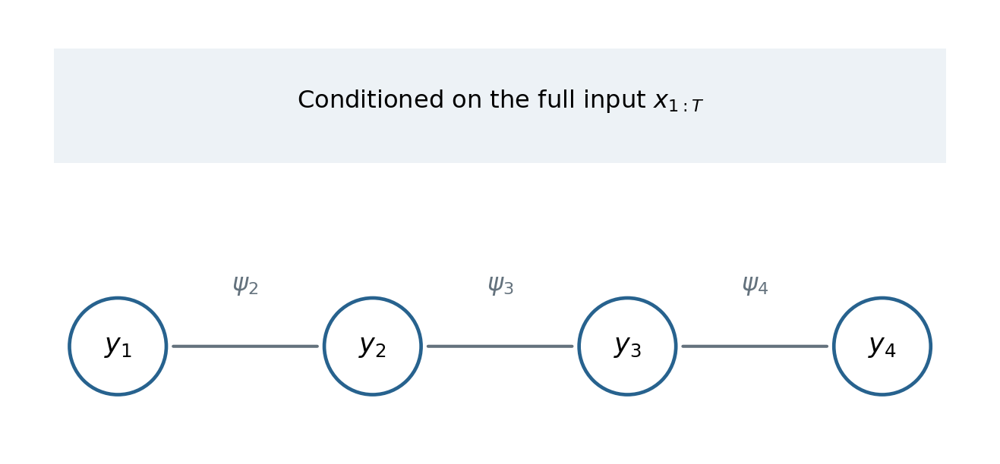

# 条件随机场 {#sec-crf}

<!-- 来源：15.CRF.md、cheatsheet.md。补全边界、状态对边缘和 Viterbi 形式。 -->

逻辑回归直接建模一个标签的条件概率，HMM 则建模状态与观测的联合分布。序列标注希望综合整段输入并协调相邻标签，可以直接建模 $p(y_{1:T}\mid x_{1:T})$。线性链 CRF 是这一思路的经典实现。

## 从 HMM 到 MEMM：局部归一化的限制

HMM 的生成式分解为

$$
p(x,y)=\pi_{y_1}b_{y_1}(x_1)
\prod_{t=2}^Ta_{y_{t-1},y_t}b_{y_t}(x_t).
$$

观测独立性是在给定状态序列后的条件独立，不是“所有单词本来彼此独立”。HMM 同时建模观测生成，可能限制可方便使用的输入特征。

MEMM 直接建模

$$
p(y\mid x)=\prod_{t=1}^Tp(y_t\mid y_{t-1},x),
$$

每个局部转移可以是对数线性分类器，并可使用整个输入的特征。它的每个局部条件分布都要对后继状态归一化。

### Label bias 的直觉

如果一个状态只有一个允许的后继，那么局部归一化会把该转移概率强制设为 1，无论输入对这条路径提供多少支持。这种局部归一化限制了不同路径之间比较观测证据的方式，是标签偏置问题的典型直觉。

CRF 改为给整条标签路径打分，再在所有路径之间统一归一化。它保留标签链上的局部因子结构；不能简单说成“去掉箭头就破坏齐次 Markov 假设”。

## 线性链 CRF 的条件分布

令 $y_0$ 为固定的开始状态，$\mathcal S$ 为标签集合。用局部得分 $s_t$ 定义

$$
p_\theta(y\mid x)=\frac1{Z(x,\theta)}
\exp\left[\sum_{t=1}^Ts_t(y_{t-1},y_t,x)\right],
$$

$$
Z(x,\theta)=\sum_{y_{1:T}\in\mathcal S^T}
\exp\left[\sum_{t=1}^Ts_t(y_{t-1},y_t,x)\right].
$$

这是离散标签的条件概率质量函数，正文使用“条件分布”，避免误称连续 PDF。输入 $x$ 被条件化，不必再给它指定独立生成分布。

{#fig-crf width=95%}

### 转移特征与状态特征

一种常见参数化是

$$
s_t(a,b,x)=\sum_{k=1}^{K_f}\lambda_kf_k(a,b,x,t)
+\sum_{l=1}^{L_f}\eta_lg_l(b,x,t).
$$

$f_k$ 表达转移与输入关系，$g_l$ 表达某标签与输入的关系。即使参数跨时刻共享，特征仍可以依赖位置与上下文。

把参数拼成 $\theta$，把整条路径上累计的特征拼成 $F(y,x)$，可统一写成

$$
p_\theta(y\mid x)=\exp[\theta^\top F(y,x)-\log Z(x,\theta)].
$$

对固定输入，这是指数族结构。特征可以设计很多个，数量不受 $|\mathcal S|$ 或 $|\mathcal S|^2$ 的一般上界约束；仅用状态/转移指示函数时才会出现对应计数。

## 前向后向：计算配分函数与边缘

令势函数 $\psi_t(a,b;x)=e^{s_t(a,b,x)}$。对固定输入省略参数。定义 $\alpha_t(j)$ 为所有以 $y_t=j$ 结束的前缀路径的未归一化权重和：

$$
\alpha_1(j)=\psi_1(y_0,j;x),\qquad
\alpha_t(j)=\sum_{i\in\mathcal S}\alpha_{t-1}(i)\psi_t(i,j;x).
$$

末端求和得到 $Z(x)=\sum_j\alpha_T(j)$。$y_0$ 是固定值，不对它枚举所有普通标签。

后向量是固定 $y_t=i$ 后，所有后缀权重之和：

$$
\beta_T(i)=1,\qquad
\beta_t(i)=\sum_j\psi_{t+1}(i,j;x)\beta_{t+1}(j).
$$

### 单点边缘为什么是前后两部分的乘积

固定 $y_t=i$ 后，链分为左右两段。对左段所有标签求和得到 $\alpha_t(i)$，对右段所有标签求和得到 $\beta_t(i)$，所以

$$
p(y_t=i\mid x)=\frac{\alpha_t(i)\beta_t(i)}{Z(x)}.
$$

固定两个相邻标签，则

$$
p(y_{t-1}=i,y_t=j\mid x)
=\frac{\alpha_{t-1}(i)\psi_t(i,j;x)\beta_t(j)}{Z(x)},\quad t\ge2.
$$

首位置使用固定开始状态单独处理。原稿中左右两段求和的长展开，实质上就是这两个消息的定义。动态规划将枚举所有路径的指数复杂度降为 $O(T|\mathcal S|^2)$。

## 参数学习：经验特征减模型期望

给定训练序列 $(x^{(n)},y^{(n)})$，条件对数似然为

$$
\ell(\theta)=\sum_{n=1}^N
\left[\theta^\top F(y^{(n)},x^{(n)})-\log Z(x^{(n)},\theta)\right].
$$

利用指数族的对数配分函数导数：

$$
\nabla_\theta\log Z(x,\theta)=\mathbb E_{p_\theta(y\mid x)}F(y,x).
$$

因此

$$
\nabla\ell(\theta)=\sum_n\left[
F(y^{(n)},x^{(n)})-\mathbb E_{p_\theta(y\mid x^{(n)})}F(y,x^{(n)})\right].
$$

第一项来自真实标签，第二项是当前模型的平均预测特征。学习推动二者匹配。

### 为什么不需要枚举所有路径求期望

对某个转移特征，

$$
\begin{aligned}
\mathbb E\sum_t f_k(y_{t-1},y_t,x,t)
&=\sum_t\sum_y p(y\mid x)f_k(y_{t-1},y_t,x,t)\\
&=\sum_t\sum_{i,j}p(y_{t-1}=i,y_t=j\mid x)f_k(i,j,x,t).
\end{aligned}
$$

因为特征只依赖两个标签，其余标签求和形成状态对边缘。状态特征则用单点边缘。两者都可由前向后向计算。

固定特征且参数线性时，对数似然为凹函数；加入 $-\tfrac\rho2\|\theta\|^2$ 正则项后，梯度再减 $\rho\theta$。可用梯度或拟牛顿方法优化。完整训练循环是：计算消息、得到边缘与梯度、更新参数。

## 译码：选择分数最高的路径

$Z(x,\theta)$ 与待比较的标签路径无关，因此

$$
\hat y=\arg\max_y\sum_t s_t(y_{t-1},y_t,x).
$$

定义最优前缀得分 $v_t(j)$：

$$
v_1(j)=s_1(y_0,j,x),\qquad
v_t(j)=\max_i[v_{t-1}(i)+s_t(i,j,x)].
$$

保存取得最大值的前驱，从末端最优标签向前回溯，即得到 Viterbi 路径。边缘推断用求和，联合译码用最大值；二者需要分清。

## 与 HMM 的对照

| 方面 | HMM | 线性链 CRF |
|---|---|---|
| 建模对象 | $p(x,y)$ | $p(y\mid x)$ |
| 输入处理 | 需要观测生成分布 | 可使用丰富的输入特征 |
| 归一化 | 初始、转移、发射分布分别归一化 | 整条标签路径全局归一化 |
| 概率计算 | 前向后向 | 前向后向 |
| 联合译码 | Viterbi | Viterbi |
| 学习 | 常用 EM 处理未观测状态 | 有监督条件似然梯度 |

两种模型共享动态规划工具，但概率假设与学习目标不同。CRF 的优势来自条件建模和全局归一化，并非自动取消所有标签依赖结构。
