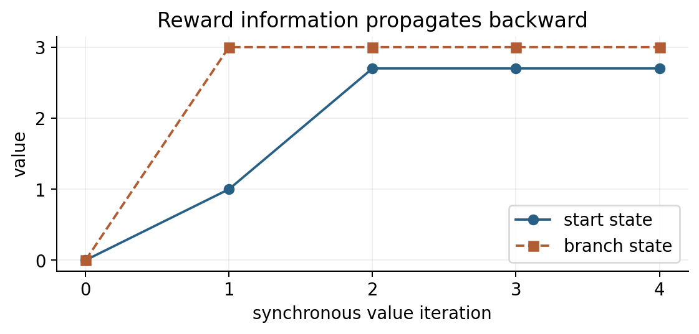

# 价值函数、Bellman 方程与动态规划 {#sec-bellman}

**学习层级：A。** 必须会从回报递推得到 Bellman 方程，并区分评估、改进与最优性。材料：白板 MDP p3–p5、DP p1–p5；CS285 L4、L7、L20。

## 价值是对未来策略的条件期望

定义 $V^\pi(s)=\mathbb E_\pi[G_t\mid S_t=s]$，$Q^\pi(s,a)=\mathbb E_\pi[G_t\mid S_t=s,A_t=a]$。$Q$ 固定当前动作，之后仍跟随 $\pi$。优势

$$A^\pi(s,a)=Q^\pi(s,a)-V^\pi(s),\qquad
V^\pi(s)=\sum_a\pi(a\mid s)Q^\pi(s,a).$$

所以 $\mathbb E_{a\sim\pi}A^\pi(s,a)=0$。优势比较的是动作与“该状态下当前策略的平均水平”，不是与奖励零点比较。

## 从回报递推到期望方程

由 $G_t=R_{t+1}+\gamma G_{t+1}$，先对下一状态条件化，再用全期望公式：

$$
\begin{aligned}
Q^\pi(s,a)&=\mathbb E[R_{t+1}+\gamma G_{t+1}\mid s,a]\\
&=r(s,a)+\gamma\sum_{s'}P(s'\mid s,a)V^\pi(s'),\\
V^\pi(s)&=\sum_a\pi(a\mid s)\left[r(s,a)+\gamma\sum_{s'}P(s'\mid s,a)V^\pi(s')\right].
\end{aligned}
$$

这是一组同时约束所有状态价值的方程，并不是“价值必须等到未来真实发生后才有定义”。随机变量的期望可以在观察结果前定义。

固定策略后，令 $P^\pi(s,s')=\sum_a\pi(a\mid s)P(s'\mid s,a)$、$r^\pi(s)=\sum_a\pi(a\mid s)r(s,a)$，得到

$$V^\pi=r^\pi+\gamma P^\pi V^\pi,
\qquad V^\pi=(I-\gamma P^\pi)^{-1}r^\pi.$$

折扣条件下逆存在，因为 $\sum_{k\geq0}\gamma^k(P^\pi)^k$ 收敛并等于该逆。计算时可以解线性方程组，不必显式求逆。

## 迭代评估与压缩

把右侧看作算子 $\mathcal T^\pi V=r^\pi+\gamma P^\pi V$。由于概率加权平均不会超过最大绝对值，

$$\|\mathcal T^\pi V-\mathcal T^\pi W\|_\infty
\leq\gamma\|V-W\|_\infty.$$

因此每次用新估计更新 $V_{k+1}=\mathcal T^\pi V_k$，误差至多缩小为原来的 $\gamma$ 倍。这里需要精确期望和全状态更新；样本/函数逼近版本另行分析。

## 为什么贪心改进有效

选择新策略 $\pi'$，使每个状态满足

$$\mathcal T^{\pi'}V^\pi(s)=\mathbb E_{a\sim\pi'}Q^\pi(s,a)\geq V^\pi(s).$$

贪心选择 $\pi'(s)\in\arg\max_aQ^\pi(s,a)$ 满足此条件，因为最大值不小于原策略的加权平均。利用 Bellman 算子的单调性，

$$V^\pi\leq\mathcal T^{\pi'}V^\pi
\leq(\mathcal T^{\pi'})^2V^\pi\leq\cdots\longrightarrow V^{\pi'}.$$

所以 $V^{\pi'}\geq V^\pi$。注意 $\arg\max$ 给出动作，$\max$ 给出数值。该证明使用精确 $Q^\pi$，并不保证用少量样本估出来的贪心策略每轮都进步。

## 策略迭代与价值迭代

策略迭代交替进行：评估 $\pi_k$ 得到 $V^{\pi_k}$；根据其 Q 值改进得到 $\pi_{k+1}$。有限 MDP 中采用一致的平局处理，可在有限个策略之间到达最优策略。

最优 Bellman 算子直接把策略平均换成最大化：

$$V^*(s)=\max_a\left[r(s,a)+\gamma\sum_{s'}P(s'\mid s,a)V^*(s')\right].$$

价值迭代反复应用这个右侧算子。关键不等式 $|\max_i x_i-\max_i y_i|\leq\max_i|x_i-y_i|$ 仍给出 $\gamma$ 压缩。策略迭代充分评估再改进；价值迭代每次只做一步最优 backup。广义策略迭代允许评估和改进交错，不要求每轮完全评估。

## 小例子：一轮评估与改进

在 @sec-setup 的小 MDP，设两状态都均匀选动作。$V^\pi(s_1)=1.5$；$Q^\pi(s_0,\text{继续})=1.35$，$Q^\pi(s_0,\text{退出})=1$，故 $V^\pi(s_0)=1.175$。新策略在起点继续、岔路选好动作，实际价值成为 $V^{\pi'}(s_0)=2.7$。

若从全零开始同步价值迭代，第一轮 $V_1(s_1)=3,V_1(s_0)=1$；第二轮 $V_2(s_0)=\max(1,0.9\times3)=2.7$。奖励信息需要沿转移向前驱传播。

{#fig-vi width=80%}

## 工具箱与自测

固定策略用期望方程，求最优用最优方程；模型已知可做 DP，模型未知转向采样。**题：** 初始 $V_0(s_0)=0$，能否只看第一轮价值迭代就认定退出最优？**答：** 不能，远期奖励尚未传播到起点。**题：** 若神经网络拟合 Bellman 目标，压缩证明是否自动保留？**答：** 不保留，回归映射也参与更新，见 @sec-approximation 与 @sec-theory。
