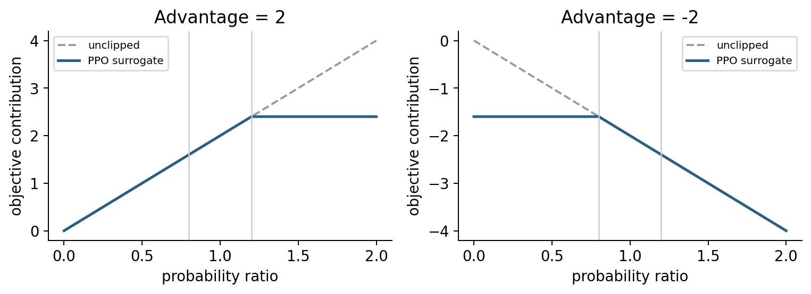

# 稳定策略改进：自然梯度、TRPO 与 PPO {#sec-ppo}

**学习层级：A/B。** PPO 目标与诊断必须掌握；自然梯度机制掌握，TRPO 数值求解细节可后补。材料：CS285 L9–10、L21；原论文 [TRPO](https://arxiv.org/abs/1502.05477)、[PPO](https://arxiv.org/abs/1707.06347)。

## 为什么沿着好梯度也会变差

梯度描述当前位置附近的变化。大步更新后，状态分布改变，旧优势估计可能失效，少数动作概率可能暴涨。控制更新幅度的目的，是让旧数据提供的局部信息在新策略处仍有参考价值。

折扣目标满足性能差异恒等式：

$$J(\pi')-J(\pi)=\frac1{1-\gamma}
\mathbb E_{s\sim d_\gamma^{\pi'},a\sim\pi'}[A^\pi(s,a)].$$

证明可把 $A^\pi=r+\gamma\mathbb EV^\pi(s')-V^\pi(s)$ 沿 $\pi'$ 轨迹折扣求和，中间 V 项抵消，留下新策略回报减初始旧价值。这里使用的是**新策略状态占用**。

## 用旧状态分布构造代理目标

把难以采集的 $d^{\pi'}$ 近似为 $d^\pi$，再只对动作做 IS，得到忽略常数的局部目标

$$L(\theta)=\mathbb E_{s,a\sim\pi_{\rm old}}[\rho_\theta(s,a)\widehat A(s,a)],
\quad\rho_\theta=\exp(\log\pi_\theta-\log\pi_{\rm old}).$$

在旧参数处，这个代理的梯度与相应策略梯度匹配；离开该点后的目标值不等于真实性能差异。重要性比不能自动修正被忽略的状态分布变化。

## 自然梯度与 TRPO 的几何

欧氏参数距离不等于策略分布距离。令 g 为目标梯度，F 为旧策略上的 Fisher 信息矩阵；局部 KL 约为 $\frac12\Delta^\top F\Delta$。求解

$$\max_\Delta g^\top\Delta
\quad\text{s.t.}\quad\frac12\Delta^\top F\Delta\leq\delta$$

在 F 正定时，方向为 $F^{-1}g$，缩放后

$$\Delta=\sqrt{\frac{2\delta}{g^\top F^{-1}g}}F^{-1}g.$$

TRPO 用局部近似、共轭梯度与线搜索等实现受约束更新。理论界、近似 KL 约束和实际有限样本求解不是同一层面的保证；奇异 F 常需要阻尼。

## PPO clipping 的分段含义

PPO 最大化

$$L_{\rm clip}=\mathbb E\left[
\min\{\rho\widehat A,\operatorname{clip}(\rho,1-\epsilon,1+\epsilon)\widehat A\}\right].$$

| 优势符号 | 被截平的一侧 | 意义 |
|---|---|---|
| $\widehat A>0$ | $\rho>1+\epsilon$ | 已明显提高好动作概率后，不再给额外代理收益 |
| $\widehat A<0$ | $\rho<1-\epsilon$ | 已明显降低坏动作概率后，不再给额外代理收益 |

取 $\epsilon=0.2$。若 $A=2,\rho=1.5$，贡献为 $\min(3,2.4)=2.4$；若 $A=-2,\rho=0.5$，贡献为 $\min(-1,-1.6)=-1.6$。朝坏方向变化时仍受线性项惩罚。图中的横轴是固定样本的概率比，并非完整网络更新轨迹。

{#fig-ppo width=90%}

Clipping 只改变目标，**不把真实概率比强制限制在区间内，也不提供硬 KL 约束**。参数共享可能让未主动更新的样本概率继续变化，因此仍需监测 KL。

## 一轮 PPO 更新应冻结什么

先用旧策略采 rollout，存储 old log-prob、old values、mask 和奖励；计算 GAE 与 return targets 后冻结。再进行有限轮 minibatch 更新：重新计算当前 log-prob，形成 ratio，更新 Actor 和 Critic。old log-prob 不能每个 epoch 重算为“当前值”，否则 ratio 被错误重置为 1。

监测平均回报、KL、clip fraction、熵、价值误差和梯度范数。近似 KL 的数值可能依估计式不同而不同，日志须写定义。KL 过大时可早停；clip fraction 高不自动等于训练失败，要结合回报和 KL 判断。

## 工具箱与自测

必须掌握：优势固定、旧概率固定、min 的符号、数据复用的范围。**题：** 同一批数据训练越多轮是否总更高效？**答：** 更多优化可能降低采样成本，也会扩大策略偏移并过拟合旧优势。**题：** PPO 是不是“不会降低回报”的算法？**答：** 不是，有限样本、近似优势和无硬约束都允许性能退化。
