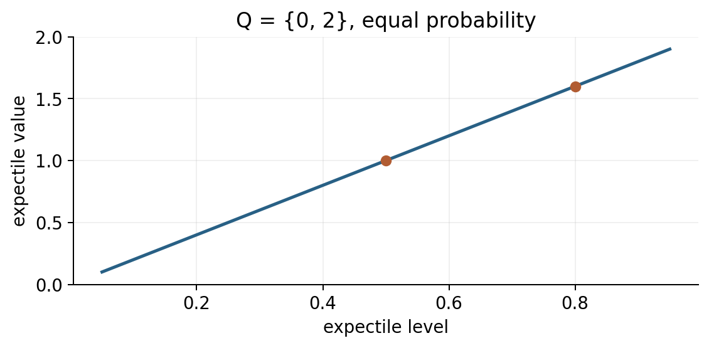

# 离线 RL：覆盖、保守性与 IQL {#sec-offline}

**学习层级：A/B。** 必须掌握 offline 与 off-policy 的区别，以及 IQL 的三组更新。材料：CS285 L17–18、L22、HW5；[IQL](https://arxiv.org/abs/2110.06169)、[CQL](https://arxiv.org/abs/2006.04779)。

## 固定数据为何更困难

在线训练可以试验新策略并修正误判；离线训练只有固定数据 $\mathcal D$，不能通过新交互验证数据外动作。即使算法本来是 off-policy，直接在固定数据上跑也可能失败。

设某状态只见动作 A 的真实回报 1，网络对没见过的 B 预测 100。Actor/max 选择 B，bootstrap 又将 100 传播到已有数据。普通回归没有 B 的标签来纠正它。这是策略优化利用外推误差的反馈，不只是训练集拟合不好。

无覆盖的行为结果通常无法从数据唯一识别：两个环境可以在所有已有数据上相同，却在 B 上给出完全不同奖励。任何强保证都需要覆盖、结构或其他额外假设。

## 三类限制方式

策略约束让新策略接近行为；悲观价值让数据外动作不那么有吸引力；数据内回归避免在关键估值步骤查询未见动作。三者可组合，但各有取舍。

简单 BC 正则 Actor 的目标可写为 $-\mathbb E Q(s,\pi_\theta(s))+\lambda\mathbb E\ell_{\rm BC}(\theta;s,a)$。动作回归式 BC 与负 log-likelihood 式 BC 不同；具体 SAC+BC 实现应跟课程作业版本对齐，不能把所有变体视为同一损失。

## CQL 的直觉与离散示意

在普通 TD 损失外，加一个抑制广泛动作价值、相对保留数据动作价值的项：

$$L_{\rm CQL}=L_{\rm TD}+\alpha\mathbb E_{s\sim\mathcal D}
\left[\log\sum_a e^{Q(s,a)}-\mathbb E_{a\sim\mathcal D(\cdot\mid s)}Q(s,a)\right].$$

这是常见离散动作形式的机制示意。连续动作需要采样近似积分等处理；“保守”的理论结论带有分布、样本与优化条件，并非每个动作的神经网络预测都自动成为严格下界。

## IQL：隐式地偏向数据内较好动作

IQL 不直接在 V 回归中最大化任意动作，而对数据动作 Q 做 expectile 回归。定义

$$\ell_\tau(u)=|\tau-\mathbf1\{u<0\}|u^2,\qquad
L_V=\mathbb E_{(s,a)\sim\mathcal D}\ell_\tau(Q_{\bar\phi}(s,a)-V_\psi(s)).$$

$\tau>1/2$ 时，V 低于 Q 的正残差惩罚更重，V 倾向数据支持内较高 Q。它是非对称平方损失得到的 expectile，不是 quantile；后者对应非对称绝对损失。

Critic 回归

$$L_Q=\mathbb E_{\mathcal D}\left[Q_\phi(s,a)-\operatorname{sg}(r+\gamma mV_\psi(s'))\right]^2.$$

Actor 做优势加权行为克隆：

$$L_\pi=-\mathbb E_{\mathcal D}
\left[\operatorname{sg}\left(e^{\beta(Q_{\bar\phi}(s,a)-V_\psi(s))}\right)\log\pi_\theta(a\mid s)\right].$$

$\beta$ 在此是逆温度；实践常裁剪指数权重。三组更新对应“数据内高值基线、价值传播、策略提取”。最终策略仍可能因函数泛化偏出数据区域，IQL 不是免除所有分布偏移问题。

## Expectile 手算

某状态数据动作 Q 值为 0 与 2，各一半。若 $0<v<2$，一阶条件为 $(1-\tau)v=\tau(2-v)$，故 $v=2\tau$。$\tau=0.5$ 得 1，$\tau=0.8$ 得 1.6。它偏向高值但未凭空取数据外最大值。

{#fig-expectile width=80%}

## 离线策略评估与选择

IS 按目标/行为比修正回报，但依赖行为概率和覆盖，长轨迹方差可能很高。Fitted Q Evaluation 固定待评估策略，用其下一动作做 Bellman 回归；它仍依赖数据覆盖与函数类，不是独立真值。Doubly robust 类方法组合模型与权重校正，也需明确假设。

若有额外在线评估权限，应单独统计评估交互；不能反复用测试任务挑超参，再把它当未见测试集。训练中的 Q 高低不适合跨算法直接当真实回报排名。

## 自测

**题：** 为什么保守越强不一定越好？答：过度限制会退化到模仿，失去组合数据中优良行为的能力。**题：** IQL 的 V 是否就是 $\max_aQ(s,a)$？答：不是，它是按数据条件动作分布得到的上 expectile，只在额外极限与覆盖条件下接近最大值。
