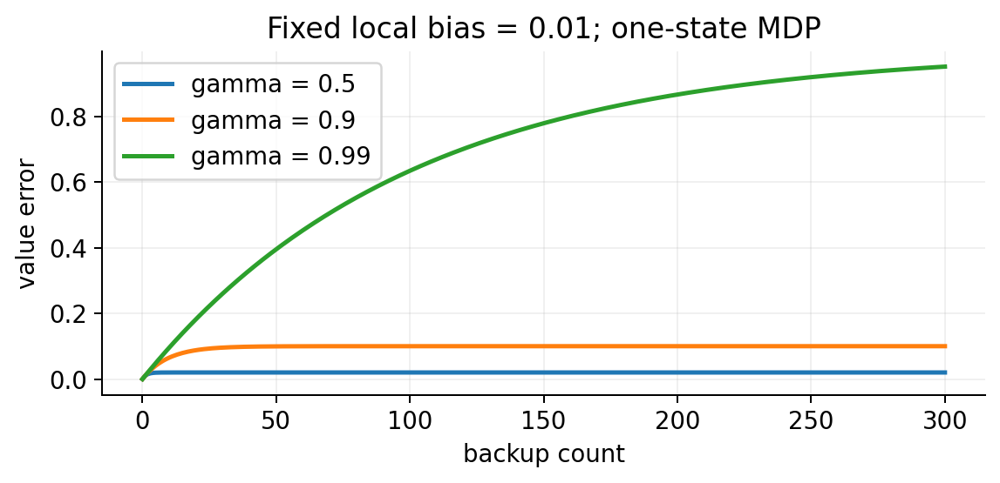

# 强化学习理论：误差、采样与保证边界 {#sec-theory}

**学习层级：A/B/C。** Bellman 压缩必须掌握；误差递推和浓缩要会使用；高阶样本复杂度证明以后补。材料：CS285 L20 官方讲义与 L22 复习。它们补足无转录的理论部分。

理论先限定什么被观测、哪些对象精确，再问误差怎样变化。这个顺序能防止把“理想算子收敛”当成“某个深度实现必然收敛”。

## 先固定问题，再陈述保证

这里先采用有限状态/动作、无限时域折扣 MDP，$0\leq\gamma<1$，且 $|r(s,a)|\leq R_{\max}$。令 $r(s,a)$ 表示一步奖励的条件均值，$P(\cdot\mid s,a)$ 为转移分布，$\|\cdot\|_\infty$ 表示对所有状态动作取最大绝对值。

“价值迭代收敛”“用样本估计模型的误差小”“深度 Q 网络训练稳定”是三个不同命题，不能相互替代。样本复杂度还必须说明样本如何获得；给定每个状态动作的采样能力，并未解决如何探索到这些状态。

## Bellman 压缩：为什么精确价值迭代能收敛

定义最优 Bellman 算子：

$$
(\mathcal TQ)(s,a)=r(s,a)+\gamma\mathbb E_{s'\sim P(\cdot\mid s,a)}\left[\max_{a'}Q(s',a')\right].
$$

利用 $|\max_i x_i-\max_i y_i|\leq\max_i|x_i-y_i|$，得到

$$
\|\mathcal TQ-\mathcal T\widetilde Q\|_\infty
\leq\gamma\|Q-\widetilde Q\|_\infty.
$$

所以 $Q_{k+1}=\mathcal TQ_k$ 满足

$$
\|Q_k-Q^*\|_\infty\leq\gamma^k\|Q_0-Q^*\|_\infty.
$$

这里证明的是精确算子的压缩。若更新中加入回归投影、采样或非凸优化，就需要额外分析，不能把同一结论直接贴到 DQN 上。

## 近似更新：把两类误差接起来

设一次学习后的 $Q_{k+1}$ 与精确 backup 的差满足

$$
\|Q_{k+1}-\mathcal TQ_k\|_\infty\leq\epsilon_k.
$$

记 $e_k=\|Q_k-Q^*\|_\infty$，三角不等式给出

$$
e_{k+1}\leq\gamma e_k+\epsilon_k.
$$

若每一步 $\epsilon_k\leq\epsilon$，展开递推可得

$$
e_K\leq\gamma^K e_0+\epsilon\frac{1-\gamma^K}{1-\gamma}.
$$

因此 $\limsup_K e_K\leq\epsilon/(1-\gamma)$。用 limsup 而非直接断言序列收敛，因为持续的近似误差可能导致振荡。

若 $\widehat{\mathcal T}$ 是采样得到的 backup，再拆开：

$$
\|Q_{k+1}-\mathcal TQ_k\|_\infty
\leq
\underbrace{\|Q_{k+1}-\widehat{\mathcal T}Q_k\|_\infty}_{\text{拟合/逼近与优化误差}}
+
\underbrace{\|\widehat{\mathcal T}Q_k-\mathcal TQ_k\|_\infty}_{\text{采样误差}}.
$$

低训练 MSE 不自动给出全状态动作的无穷范数误差界；没覆盖到的区域尤其如此。

**自编小例子。** 一状态、一动作、自环环境，真实奖励为 0。若每次 backup 固定多加 $0.01$，最终误差为 $0.01/(1-\gamma)$：$\gamma=0.9$ 时为 0.1，$\gamma=0.99$ 时为 1。微小的局部偏差能通过长程自举放大。

## 模型误差与有效时域

固定策略 $\pi$，令 $P^\pi$ 为状态转移矩阵。若真实模型和估计模型的奖励相同，且 $\widehat P^\pi$ 也是随机矩阵，则

$$
V^\pi-\widehat V^\pi
=\gamma(I-\gamma P^\pi)^{-1}(P^\pi-\widehat P^\pi)\widehat V^\pi.
$$

因为 $\|(I-\gamma P^\pi)^{-1}\|_\infty\leq(1-\gamma)^{-1}$，且 $\|\widehat V^\pi\|_\infty\leq R_{\max}/(1-\gamma)$，若每行转移概率的 L1 误差至多 $\epsilon_P$，则

$$
\|V^\pi-\widehat V^\pi\|_\infty
\leq\frac{\gamma R_{\max}\epsilon_P}{(1-\gamma)^2}.
$$

这是一个便于理解的固定策略界，不是最紧样本复杂度定理。奖励也有误差时要增加相应项；策略由同一数据选出来时，要额外处理统一保证。正式推导可继续参照讲义引用的 [RL Theory 教材](https://rltheorybook.github.io/)。

**本节自测。** 为什么 $\gamma$ 接近 1 时误差界恶化？为什么经验回放上的低损失不足以保证策略好？请分别回答“误差传播”与“数据覆盖”，不要混成一个原因。

## 一条带条件的采样界

固定有界 V，令 $X_j=R_j+\gamma V(S'_j)$ 为同一 $(s,a)$ 下独立样本，假设每个 X 落在长度 B 的区间。Hoeffding 给出

$$P\left(\left|N^{-1}\sum_jX_j-\mathbb E X\right|>\epsilon\right)
\leq2\exp(-2N\epsilon^2/B^2).$$

若有限 MDP 的每个状态动作都有 N 个这样的样本，union bound 得到同时误差不超过 $\epsilon$ 的充分样本量

$$N\geq\frac{B^2}{2\epsilon^2}\log\frac{2|\mathcal S||\mathcal A|}{\delta}.$$

这是每对 N 个样本，总量还要乘状态动作数；它没有说明如何走到所有状态。这里 V 预先固定或独立于这些评估样本。若 V 也由同一批数据自适应选择，要用独立样本、统一浓缩或合适的依赖分析，不能直接套这条固定函数界。

## 从价值误差到策略损失

若估计 Q 满足 $\|\widehat Q-Q^*\|_\infty\leq\epsilon$，令 $\widehat\pi$ 对它贪心。设 a* 为真最优动作，则

$$Q^*(s,a^*)\leq\widehat Q(s,a^*)+\epsilon
\leq\widehat Q(s,\widehat\pi(s))+\epsilon
\leq Q^*(s,\widehat\pi(s))+2\epsilon.$$

每个状态的局部最优性差距至多 $2\epsilon$，再沿执行策略传播，得到 $\|V^*-V^{\widehat\pi}\|_\infty\leq2\epsilon/(1-\gamma)$。这是基于全域误差保证的一个简单界；只有训练集误差小并不足以使用它。

{#fig-error width=85%}

## Regret、PAC 与预测误差是不同问题

Regret 统计学习过程中相对基准策略累计损失多少；PAC 通常问多少样本后能以高概率得到近优策略；固定策略价值误差问估值是否准确。它们需要不同的采样和交互设定。L20 的入门分析不能替代所有探索或神经网络理论。

一张可复用的定理记录卡应写：问题设定、采样方式、函数类、奖励/时域、概率水平、误差范数、保证对象、未覆盖情形。形式复杂但条件空白的公式，不应进入速查表。

## 自测

**题：** 每个状态动作都有 N 个独立样本的界，是不是在线探索算法？**答：** 不是，它假定了采样覆盖，探索困难尚未解决。

**题：** 为什么使用 limsup 描述有持续噪声的误差？**答：** 误差可以在界内振荡，并不一定收敛到某个数值。
